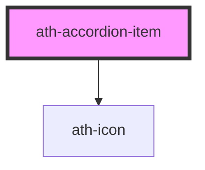

# ath-accordion-item

<!-- Auto Generated Below -->

## Properties

| Property       | Attribute       | Description                           | Type      | Default     |
| -------------- | --------------- | ------------------------------------- | --------- | ----------- |
| `description`  | `description`   | Descriprion of heading item           | `string`  | `undefined` |
| `disabled`     | `disabled`      | The accordion item is disabled        | `boolean` | `false`     |
| `expanded`     | `expanded`      | The accordion item is expanded        | `boolean` | `false`     |
| `headingLevel` | `heading-level` | The accordion item aria-level         | `string`  | `'2'`       |
| `headingText`  | `heading-text`  | Title of heading item                 | `string`  | `undefined` |
| `icon`         | `icon`          | The code of the accordion item's icon | `string`  | `undefined` |
| `noDivider`    | `no-divider`    | The accordion item divider bottom     | `boolean` | `false`     |

## Events

| Event    | Description | Type                |
| -------- | ----------- | ------------------- |
| `opened` |             | `CustomEvent<void>` |

## Methods

### `close() => Promise<void>`

#### Returns

Type: `Promise<void>`

## Slots

| Slot              | Description                               |
| ----------------- | ----------------------------------------- |
| `"default"`       | Contenido del elemento de acordeón        |
| `"header-detail"` | Contenido a mostrar dentro de la cabecera |

## Dependencies

### Depends on

- [ath-icon](../../icon)

### Graph

----------------------------------------------

*Built with [StencilJS](https://stenciljs.com/)*
