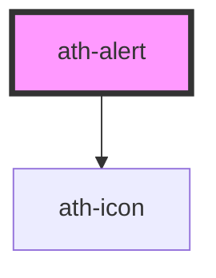

# ath-alert

<!-- Auto Generated Below -->

## Properties

| Property         | Attribute          | Description                 | Type                                           | Default             |
| ---------------- | ------------------ | --------------------------- | ---------------------------------------------- | ------------------- |
| `closeAriaLabel` | `close-aria-label` | Close button aria-label     | `string`                                       | `'Cerrar alerta'`   |
| `color`          | `color`            | The color of the message    | `"danger" \| "info" \| "success" \| "warning"` | `AlertColor.Info`   |
| `description`    | `description`      | Descripcion del alert       | `string`                                       | `undefined`         |
| `hasClose`       | `has-close`        | Has button close            | `boolean`                                      | `true`              |
| `headingLevel`   | `heading-level`    | Nivel de heading del título | `number`                                       | `6`                 |
| `headingText`    | `heading-text`     | Titulo del alert            | `string`                                       | `undefined`         |
| `isUrgent`       | `is-urgent`        | Titulo del alert            | `boolean`                                      | `false`             |
| `type`           | `type`             | Tipo de alert               | `"page" \| "section"`                          | `AlertType.Section` |

## Dependencies

### Depends on

- [ath-icon](../icon)

### Graph

----------------------------------------------

*Built with [StencilJS](https://stenciljs.com/)*
