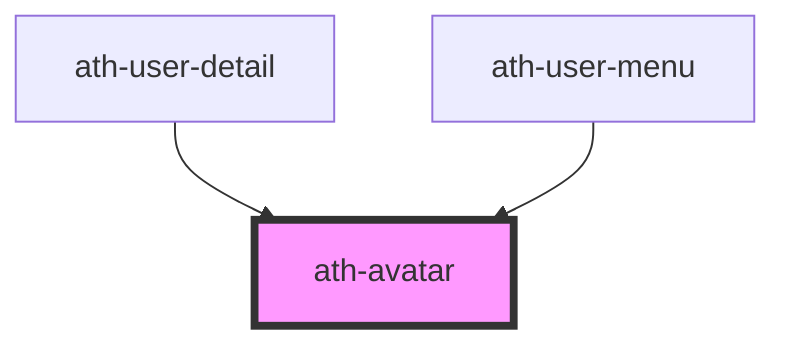

# ath-avatar

<!-- Auto Generated Below -->

## Properties

| Property         | Attribute         | Description                                          | Type                                 | Default              |
| ---------------- | ----------------- | ---------------------------------------------------- | ------------------------------------ | -------------------- |
| `ariaLabelledby` | `aria-labelledby` | The aria-labelledby attribute of the icon            | `string`                             | `undefined`          |
| `avatarName`     | `avatar-name`     | Name used to generate initials if none are provided. | `string`                             | `undefined`          |
| `initials`       | `initials`        | Initials to display in the avatar.                   | `string`                             | `undefined`          |
| `size`           | `size`            | Size of the avatar.                                  | `"lg" \| "md" \| "sm" \| "xs"`       | `AvatarSizes.Medium` |
| `type`           | `type`            | Type of avatar (image or initials).                  | `"default" \| "image" \| "initials"` | `undefined`          |

## Dependencies

### Used by

 - [ath-user-detail](../user/user-detail)
 - [ath-user-menu](../user/user-menu)

### Graph

----------------------------------------------

*Built with [StencilJS](https://stenciljs.com/)*
