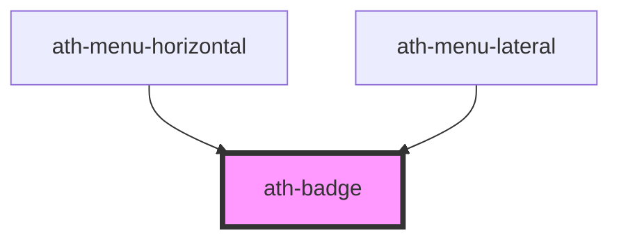

# ath-badge

<!-- Auto Generated Below -->

## Properties

| Property    | Attribute    | Description                                                       | Type                                                                     | Default               |
| ----------- | ------------ | ----------------------------------------------------------------- | ------------------------------------------------------------------------ | --------------------- |
| `color`     | `color`      | Badge color accompanying the purpose of the message               | `"accent" \| "danger" \| "disabled" \| "info" \| "success" \| "warning"` | `BADGE_DEFAULT_COLOR` |
| `distanceX` | `distance-x` | Custom horizontal distance of the badge from its default position | `number`                                                                 | `0`                   |
| `distanceY` | `distance-y` | Custom vertical distance of the badge from its default position   | `number`                                                                 | `0`                   |
| `label`     | `label`      | Accessibility label describing the message                        | `any`                                                                    | `undefined`           |
| `max`       | `max`        | Value from which a + will be added once exceeded by the "value"   | `number`                                                                 | `MAX_VALUE`           |
| `position`  | `position`   | Positioning of the badge relative to the slot                     | `"right" \| "top-right"`                                                 | `undefined`           |
| `type`      | `type`       | The badge can display a value or be a decorative element          | `"dot" \| "numeric"`                                                     | `BADGE_DEFAULT_TYPE`  |
| `value`     | `value`      | Value displayed within the badge if it is "numeric"               | `number`                                                                 | `0`                   |

## Dependencies

### Used by

 - [ath-menu-horizontal](../menu-horizontal)
 - [ath-menu-lateral](../menu-lateral)

### Graph

----------------------------------------------

*Built with [StencilJS](https://stenciljs.com/)*
