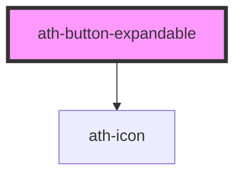

# ath-button-expandable

<!-- Auto Generated Below -->

## Properties

| Property         | Attribute         | Description                                            | Type                   | Default                            |
| ---------------- | ----------------- | ------------------------------------------------------ | ---------------------- | ---------------------------------- |
| `collapseTarget` | `collapse-target` |                                                        | `string`               | `undefined`                        |
| `disabled`       | `disabled`        | The button is disabled                                 | `boolean`              | `false`                            |
| `icon`           | `icon`            | The code of the button's icon (used with iconPosition) | `string`               | `undefined`                        |
| `size`           | `size`            | The size of the buton                                  | `"lg" \| "md" \| "sm"` | `ButtonExpandableSizesTypes.Large` |

## Events

| Event               | Description | Type                  |
| ------------------- | ----------- | --------------------- |
| `athToggleCollapse` |             | `CustomEvent<string>` |

## Methods

### `setFocus() => Promise<void>`

#### Returns

Type: `Promise<void>`

## Dependencies

### Depends on

- [ath-icon](../icon)

### Graph

----------------------------------------------

*Built with [StencilJS](https://stenciljs.com/)*
