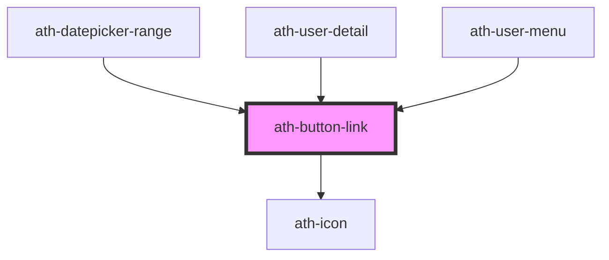

# ath-button-link

<!-- Auto Generated Below -->

## Properties

| Property       | Attribute       | Description                          | Type                           | Default                   |
| -------------- | --------------- | ------------------------------------ | ------------------------------ | ------------------------- |
| `color`        | `color`         | The color variant of the button-link | `"primary" \| "secondary"`     | `ButtonLinkColor.Primary` |
| `disabled`     | `disabled`      | The button-link is disabled          | `boolean`                      | `false`                   |
| `icon`         | `icon`          | The code of the button-link's icon   | `string`                       | `undefined`               |
| `iconPosition` | `icon-position` | Icon Position                        | `"left" \| "right"`            | `ButtonLinkPosition.Left` |
| `size`         | `size`          | The size of the buton-link           | `"lg" \| "md" \| "sm" \| "xs"` | `ButtonLinkSize.Medium`   |

## Events

| Event      | Description                              | Type                |
| ---------- | ---------------------------------------- | ------------------- |
| `athBlur`  | Emitted when the button-link loses focus | `CustomEvent<void>` |
| `athClick` | Emitted when the button-link is clicked  | `CustomEvent<void>` |
| `athFocus` | Emitted when the button-link gains focus | `CustomEvent<void>` |

## Methods

### `setFocus() => Promise<void>`

#### Returns

Type: `Promise<void>`

## Shadow Parts

| Part                   | Description |
| ---------------------- | ----------- |
| `"button-link-styles"` |             |

## Dependencies

### Used by

 - [ath-datepicker-range](../datepicker-range)
 - [ath-user-detail](../user/user-detail)
 - [ath-user-menu](../user/user-menu)

### Depends on

- [ath-icon](../icon)

### Graph

----------------------------------------------

*Built with [StencilJS](https://stenciljs.com/)*
