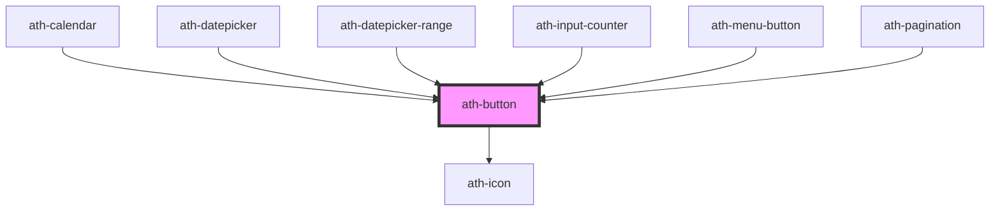

# ath-button

<!-- Auto Generated Below -->

## Properties

| Property       | Attribute       | Description                                            | Type                                         | Default                   |
| -------------- | --------------- | ------------------------------------------------------ | -------------------------------------------- | ------------------------- |
| `clear`        | `clear`         | The clear of the button (background and border color)  | `boolean`                                    | `false`                   |
| `color`        | `color`         | The color variant of the button                        | `"primary" \| "secondary"`                   | `ButtonColor.Primary`     |
| `disabled`     | `disabled`      | The button is disabled                                 | `boolean`                                    | `false`                   |
| `fullWidth`    | `full-width`    | The button can be adapted to its container width       | `boolean`                                    | `false`                   |
| `icon`         | `icon`          | The code of the button's icon (used with iconPosition) | `string`                                     | `undefined`               |
| `iconPosition` | `icon-position` | Whether the button has an icon and his position        | `"icon-only" \| "left" \| "none" \| "right"` | `ButtonIconPosition.None` |
| `size`         | `size`          | The size of the buton                                  | `"lg" \| "md" \| "sm" \| "xs"`               | `ButtonSize.Medium`       |
| `type`         | `type`          | The type of the button                                 | `"button" \| "reset" \| "submit"`            | `ButtonType.Button`       |

## Events

| Event      | Description                         | Type                |
| ---------- | ----------------------------------- | ------------------- |
| `athBlur`  | Emitted when the button loses focus | `CustomEvent<void>` |
| `athClick` | Emitted when the button is clicked  | `CustomEvent<void>` |
| `athFocus` | Emitted when the button gains focus | `CustomEvent<void>` |

## Methods

### `setFocus() => Promise<void>`

#### Returns

Type: `Promise<void>`

## Shadow Parts

| Part              | Description |
| ----------------- | ----------- |
| `"button-styles"` |             |

## Dependencies

### Used by

 - [ath-calendar](../calendar)
 - [ath-datepicker](../datepicker)
 - [ath-datepicker-range](../datepicker-range)
 - [ath-input-counter](../input-counter)
 - [ath-menu-button](../menu-button)
 - [ath-pagination](../pagination)

### Depends on

- [ath-icon](../icon)

### Graph

----------------------------------------------

*Built with [StencilJS](https://stenciljs.com/)*
