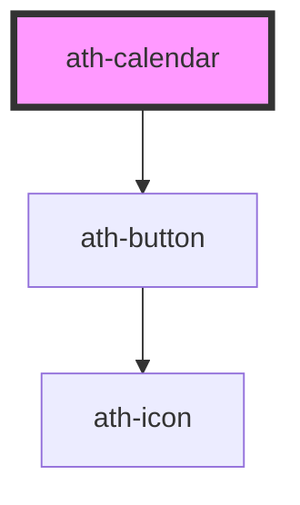

# ath-calendar

<!-- Auto Generated Below -->

## Properties

| Property              | Attribute              | Description                                    | Type                          | Default                  |
| --------------------- | ---------------------- | ---------------------------------------------- | ----------------------------- | ------------------------ |
| `color`               | `color`                | The color of the Calendar.                     | `"accent" \| "primary"`       | `CalendarColors.Primary` |
| `disabledDates`       | `disabled-dates`       | List of days which are shown as disabled.      | `string`                      | `undefined`              |
| `highlightedDates`    | `highlighted-dates`    | List of days which are shown as highlighted.   | `string`                      | `undefined`              |
| `highlightedWeekends` | `highlighted-weekends` | If true, all the weekends will be highlighted. | `boolean`                     | `false`                  |
| `max`                 | `max`                  | The maximum date that can be selected.         | `string`                      | `undefined`              |
| `min`                 | `min`                  | The minimum date that can be selected.         | `string`                      | `undefined`              |
| `selected`            | `selected`             |                                                | `string`                      | `undefined`              |
| `type`                | `type`                 | The type of the Calendar.                      | `"date" \| "month" \| "year"` | `CalendarTypes.Date`     |

## Events

| Event       | Description                                                                                | Type                  |
| ----------- | ------------------------------------------------------------------------------------------ | --------------------- |
| `athChange` | Emitted when the value has changed. This event doesn't fire until the control loses focus. | `CustomEvent<string>` |

## Dependencies

### Depends on

- [ath-button](../button)

### Graph

----------------------------------------------

*Built with [StencilJS](https://stenciljs.com/)*
