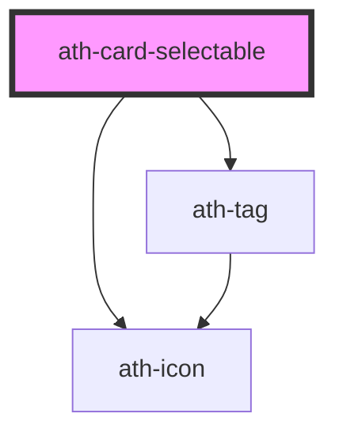

# ath-card-selectable

<!-- Auto Generated Below -->

## Properties

| Property      | Attribute      | Description                            | Type                        | Default                     |
| ------------- | -------------- | -------------------------------------- | --------------------------- | --------------------------- |
| `disabled`    | `disabled`     | Indicates whether the card is disabled | `boolean`                   | `false`                     |
| `headingText` | `heading-text` | headline of the card                   | `string`                    | `undefined`                 |
| `overline`    | `overline`     | overline of the card                   | `string`                    | `undefined`                 |
| `selected`    | `selected`     | Indicates whether the card is selected | `boolean`                   | `false`                     |
| `size`        | `size`         | Size of the card                       | `"md" \| "sm"`              | `CardSelectableSize.Small`  |
| `subtitle`    | `subtitle`     | subtitle of the card                   | `string`                    | `undefined`                 |
| `tag`         | `tag`          | tag of the card                        | `string`                    | `undefined`                 |
| `type`        | `type`         | type of card                           | `"multiselect" \| "single"` | `CardSelectableType.Single` |

## Events

| Event       | Description | Type                |
| ----------- | ----------- | ------------------- |
| `athBlur`   |             | `CustomEvent<void>` |
| `athChange` |             | `CustomEvent<any>`  |
| `athFocus`  |             | `CustomEvent<void>` |

## Methods

### `select(firstLoad: boolean) => Promise<void>`

#### Parameters

| Name        | Type      | Description |
| ----------- | --------- | ----------- |
| `firstLoad` | `boolean` |             |

#### Returns

Type: `Promise<void>`

### `unselect() => Promise<void>`

#### Returns

Type: `Promise<void>`

## Dependencies

### Depends on

- [ath-icon](../icon)
- [ath-tag](../tag)

### Graph

----------------------------------------------

*Built with [StencilJS](https://stenciljs.com/)*
