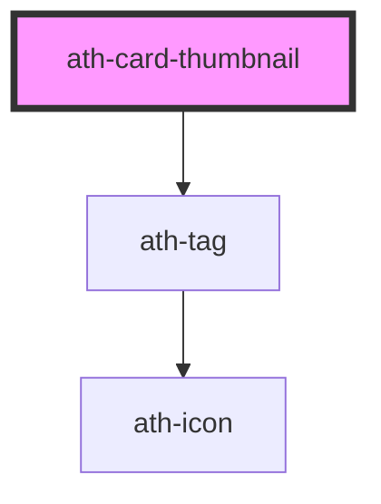

# ath-card-thumbnail

<!-- Auto Generated Below -->

## Properties

| Property        | Attribute        | Description         | Type                                   | Default                 |
| --------------- | ---------------- | ------------------- | -------------------------------------- | ----------------------- |
| `bottomTag`     | `bottom-tag`     | Text for bottom tag | `string`                               | `undefined`             |
| `highlightText` | `highlight-text` | text highlight      | `string`                               | `undefined`             |
| `topTag`        | `top-tag`        | Text for top tag    | `string`                               | `undefined`             |
| `type`          | `type`           | type of thumnail    | `"avatar" \| "default" \| "highlight"` | `ThumbnailType.Default` |

## Methods

### `updateTypeCard(isFluid: boolean, isVertical: boolean) => Promise<void>`

#### Parameters

| Name         | Type      | Description |
| ------------ | --------- | ----------- |
| `isFluid`    | `boolean` |             |
| `isVertical` | `boolean` |             |

#### Returns

Type: `Promise<void>`

## Dependencies

### Depends on

- [ath-tag](../../tag)

### Graph

----------------------------------------------

*Built with [StencilJS](https://stenciljs.com/)*
