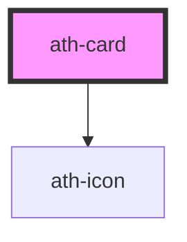

# ath-card

<!-- Auto Generated Below -->

## Properties

| Property         | Attribute          | Description                | Type                         | Default                    |
| ---------------- | ------------------ | -------------------------- | ---------------------------- | -------------------------- |
| `ariaLabelledBy` | `aria-labelled-by` | ancho máximo de la card    | `string`                     | `undefined`                |
| `clickable`      | `clickable`        | Card is clickable          | `boolean`                    | `false`                    |
| `fluid`          | `fluid`            | if Card thumbnail is fluid | `boolean`                    | `false`                    |
| `maxWidth`       | `max-width`        | ancho máximo de la card    | `string`                     | `undefined`                |
| `orientation`    | `orientation`      | Orientation Card           | `"horizontal" \| "vertical"` | `CardOrientation.Vertical` |
| `size`           | `size`             | Size of the card           | `"md" \| "sm"`               | `CardSize.Small`           |
| `width`          | `width`            | ancho de la card           | `string`                     | `undefined`                |

## Events

| Event      | Description                   | Type                |
| ---------- | ----------------------------- | ------------------- |
| `athBlur`  | Emitted when card loses focus | `CustomEvent<void>` |
| `athClick` | Emitted when card is clicked  | `CustomEvent<void>` |
| `athFocus` | Emitted when card gains focus | `CustomEvent<void>` |

## Dependencies

### Depends on

- [ath-icon](../icon)

### Graph

----------------------------------------------

*Built with [StencilJS](https://stenciljs.com/)*
