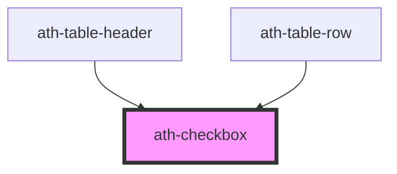

# ath-checkbox

<!-- Auto Generated Below -->

## Properties

| Property        | Attribute       | Description                                     | Type                                   | Default               |
| --------------- | --------------- | ----------------------------------------------- | -------------------------------------- | --------------------- |
| `ariaLabel`     | `aria-label`    | Accessible text when there is no visible label  | `string`                               | `undefined`           |
| `autofocus`     | `autofocus`     | If the element is focused                       | `boolean`                              | `false`               |
| `checked`       | `checked`       | If the checkbox is checked by default           | `boolean`                              | `false`               |
| `disabled`      | `disabled`      | If it is disabled                               | `boolean`                              | `false`               |
| `feedback`      | `feedback`      | Type of feedback                                | `"error" \| "none" \| "success"`       | `FeedbackType.None`   |
| `feedbackText`  | `feedback-text` | Text of the feedback                            | `string`                               | `undefined`           |
| `helperText`    | `helper-text`   | Text below the checkbox (helper text)           | `string`                               | `undefined`           |
| `hideRequired`  | `hide-required` | If the required character is shown in the label | `boolean`                              | `false`               |
| `indeterminate` | `indeterminate` | If the checkbox is indeterminate by default     | `boolean`                              | `false`               |
| `label`         | `label`         | Label of the checkbox                           | `string`                               | `undefined`           |
| `name`          | `name`          | Name of the checkbox (necessary for forms)      | `string`                               | `undefined`           |
| `readonly`      | `readonly`      | If it is read-only                              | `boolean`                              | `false`               |
| `required`      | `required`      | If it is required                               | `boolean`                              | `false`               |
| `value`         | `value`         | Value of the checkbox                           | `"false" \| "indeterminate" \| "true"` | `CheckboxValue.False` |

## Events

| Event       | Description                           | Type                                     |
| ----------- | ------------------------------------- | ---------------------------------------- |
| `athBlur`   | Emitted when the checkbox loses focus | `CustomEvent<void>`                      |
| `athChange` | Emitted when the checkbox change      | `CustomEvent<CheckboxChangeEventDetail>` |
| `athFocus`  | Emitted when the checkbox gains focus | `CustomEvent<void>`                      |

## Methods

### `setFocus() => Promise<void>`

#### Returns

Type: `Promise<void>`

## Dependencies

### Used by

 - [ath-table-header](../table/table-header)
 - [ath-table-row](../table/table-row)

### Graph

----------------------------------------------

*Built with [StencilJS](https://stenciljs.com/)*
