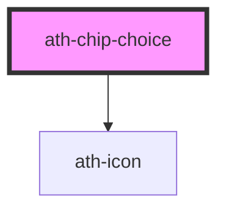

# ath-chip-choice

<!-- Auto Generated Below -->

## Properties

| Property   | Attribute  | Description                          | Type           | Default                   |
| ---------- | ---------- | ------------------------------------ | -------------- | ------------------------- |
| `disabled` | `disabled` | Indica si el chip esta deshabilitado | `boolean`      | `false`                   |
| `icon`     | `icon`     | Indica el nombre del icono a usar    | `string`       | `undefined`               |
| `label`    | `label`    | Texto del chip                       | `string`       | `undefined`               |
| `name`     | `name`     | The chip name for HTML Form API      | `string`       | `undefined`               |
| `role`     | `role`     | The role of the chip                 | `string`       | `ChipChoiceRole.Checkbox` |
| `selected` | `selected` | Indica si el chip esta seleccionado  | `boolean`      | `false`                   |
| `size`     | `size`     | Indica el tamaño del chip (sm/md)    | `"md" \| "sm"` | `ChipChoiceSize.Medium`   |
| `value`    | `value`    | The chip value for HTML Form API     | `string`       | `undefined`               |

## Events

| Event       | Description | Type                |
| ----------- | ----------- | ------------------- |
| `athBlur`   |             | `CustomEvent<void>` |
| `athChange` |             | `CustomEvent<any>`  |
| `athFocus`  |             | `CustomEvent<void>` |

## Methods

### `select() => Promise<void>`

#### Returns

Type: `Promise<void>`

### `unselect() => Promise<void>`

#### Returns

Type: `Promise<void>`

## Dependencies

### Depends on

- [ath-icon](../icon)

### Graph

----------------------------------------------

*Built with [StencilJS](https://stenciljs.com/)*
