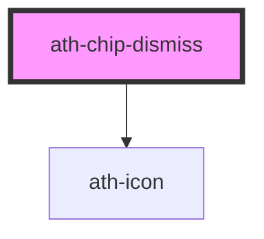

# ath-chip-dismiss

<!-- Auto Generated Below -->

## Properties

| Property       | Attribute       | Description                                           | Type           | Default                  |
| -------------- | --------------- | ----------------------------------------------------- | -------------- | ------------------------ |
| `disabled`     | `disabled`      | The button is disabled                                | `boolean`      | `false`                  |
| `headingText`  | `heading-text`  | The text in the chip                                  | `string`       | `undefined`              |
| `icon`         | `icon`          | The icon to the left                                  | `string`       | `undefined`              |
| `labelDismiss` | `label-dismiss` | The accesible label-dismiss attribute in chip dismiss | `string`       | `'Eliminar'`             |
| `size`         | `size`          | The size of the chip dismiss                          | `"md" \| "sm"` | `ChipDismissSize.Medium` |

## Events

| Event        | Description                        | Type                |
| ------------ | ---------------------------------- | ------------------- |
| `athDismiss` | Emitted when the x icon is clicked | `CustomEvent<void>` |

## Dependencies

### Depends on

- [ath-icon](../icon)

### Graph

----------------------------------------------

*Built with [StencilJS](https://stenciljs.com/)*
