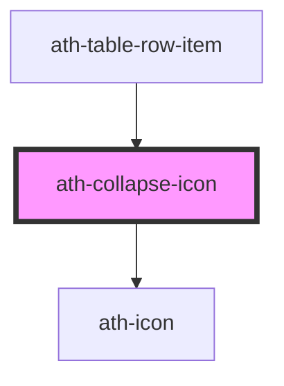

# ath-collapse-icon

<!-- Auto Generated Below -->

## Properties

| Property   | Attribute  | Description            | Type      | Default |
| ---------- | ---------- | ---------------------- | --------- | ------- |
| `expanded` | `expanded` | Current expanded state | `boolean` | `false` |

## Dependencies

### Used by

 - [ath-table-row-item](../table/table-row-item)

### Depends on

- [ath-icon](../icon)

### Graph

----------------------------------------------

*Built with [StencilJS](https://stenciljs.com/)*
