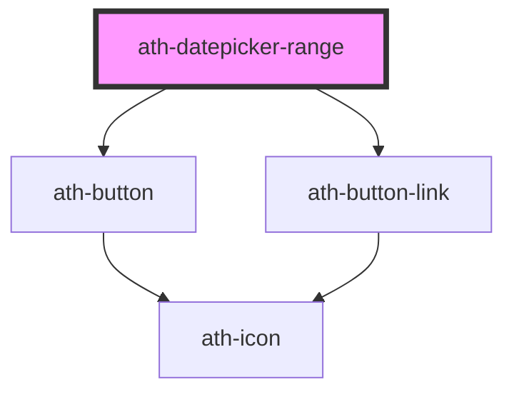

# ath-datepicker-range

<!-- Auto Generated Below -->

## Properties

| Property              | Attribute                | Description                                                                                    | Type                          | Default                         |
| --------------------- | ------------------------ | ---------------------------------------------------------------------------------------------- | ----------------------------- | ------------------------------- |
| `autofocus`           | `autofocus`              | Whether the datepicker is focused on page load.                                                | `boolean`                     | `undefined`                     |
| `color`               | `color`                  | The color of the datepicker-range.                                                             | `"accent" \| "primary"`       | `DatepickerRangeColors.Primary` |
| `disabled`            | `disabled`               | If true, the user cannot interact with the input.                                              | `boolean`                     | `false`                         |
| `disabledDates`       | `disabled-dates`         | List of days which are shown as disabled.                                                      | `string`                      | `undefined`                     |
| `feedback`            | `feedback`               | The type of the feedback. If 'error' the error feedback will be shown                          | `"error" \| "none"`           | `DatepickerRangeFeedbacks.None` |
| `feedbackText`        | `feedback-text`          | The feedback message.                                                                          | `string`                      | `undefined`                     |
| `format`              | `format`                 | Date format to be used in the datepicker-range. Only used when the type is 'date'.             | `string`                      | `'DD/MM/YYYY'`                  |
| `helperText`          | `helper-text`            | Message to help the user fills the datepicker-range.                                           | `string`                      | `undefined`                     |
| `hidePanel`           | `hide-panel`             | If true, the side panel will be hidden.                                                        | `boolean`                     | `false`                         |
| `hideRequired`        | `hide-required`          | If true, the * asterisk will be show when required = true.                                     | `boolean`                     | `false`                         |
| `highlightedDates`    | `highlighted-dates`      | List of days which are shown as highlighted.                                                   | `string`                      | `undefined`                     |
| `highlightedWeekends` | `highlighted-weekends`   | If true, all the weekends will be highlighted.                                                 | `boolean`                     | `false`                         |
| `inputAriaLabelEnd`   | `input-aria-label-end`   | The aria-label attribute of the end input                                                      | `string`                      | `undefined`                     |
| `inputAriaLabelStart` | `input-aria-label-start` | The aria-label attribute of the start input                                                    | `string`                      | `undefined`                     |
| `label`               | `label`                  | Caption of the datepicker-range                                                                | `string`                      | `undefined`                     |
| `labelEnd`            | `label-end`              | Caption of the datepicker-range                                                                | `string`                      | `undefined`                     |
| `labelStart`          | `label-start`            | Caption of the range start of the datepicker-range                                             | `string`                      | `undefined`                     |
| `max`                 | `max`                    | The maximum date that can be selected.                                                         | `string`                      | `undefined`                     |
| `min`                 | `min`                    | The minimum date that can be selected.                                                         | `string`                      | `undefined`                     |
| `name`                | `name`                   | The name of the datepicker-range. Submitted with the form as part of a name/value pair         | `string`                      | `undefined`                     |
| `placeholderEnd`      | `placeholder-end`        |                                                                                                | `string`                      | `undefined`                     |
| `placeholderStart`    | `placeholder-start`      |                                                                                                | `string`                      | `undefined`                     |
| `readonly`            | `readonly`               | If true, the user cannot modify the value.                                                     | `boolean`                     | `false`                         |
| `required`            | `required`               | If true, the user must fill in a value before submitting a form.                               | `boolean`                     | `false`                         |
| `requiredEnd`         | `required-end`           | If true, the user must fill in a value of end range before submitting a form.                  | `boolean`                     | `false`                         |
| `requiredStart`       | `required-start`         | If true, the user must fill in a value of start range before submitting a form.                | `boolean`                     | `false`                         |
| `size`                | `size`                   | The size of the datepicker-range.                                                              | `"lg" \| "md" \| "sm"`        | `DatepickerRangeSizes.Medium`   |
| `submitOnEnter`       | `submit-on-enter`        | If true, submit the form when pressing Enter in the input field and the input is inside a form | `boolean`                     | `false`                         |
| `tooltipText`         | `tooltip-text`           | Text to be shown in the tooltip                                                                | `string`                      | `undefined`                     |
| `type`                | `type`                   | The type of the datepicker-range.                                                              | `"date" \| "month" \| "year"` | `DatepickerRangeTypes.Date`     |
| `value`               | `value`                  | Current value of the form control. Submitted with the form as part of a name/value pair.       | `string`                      | `undefined`                     |

## Events

| Event       | Description                                                                                | Type                  |
| ----------- | ------------------------------------------------------------------------------------------ | --------------------- |
| `athBlur`   | Emitted when the input loses focus                                                         | `CustomEvent<void>`   |
| `athChange` | Emitted when the value has changed. This event doesn't fire until the control loses focus. | `CustomEvent<string>` |
| `athFocus`  | Emitted when the input gains focus                                                         | `CustomEvent<void>`   |

## Methods

### `setFocus() => Promise<void>`

Method to set the focus on the input element

#### Returns

Type: `Promise<void>`

### `setFocusEnd() => Promise<void>`

Method to set the focus on the second input element

#### Returns

Type: `Promise<void>`

## Dependencies

### Depends on

- [ath-button](../button)
- [ath-button-link](../button-link)

### Graph

----------------------------------------------

*Built with [StencilJS](https://stenciljs.com/)*
