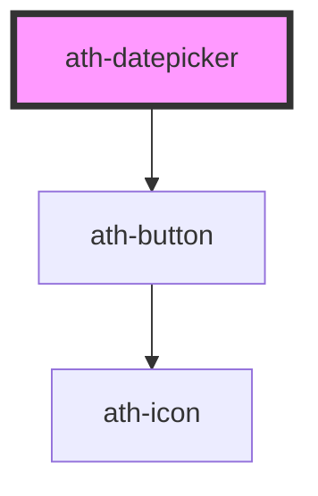

# ath-datepicker

<!-- Auto Generated Below -->

## Properties

| Property              | Attribute              | Description                                                                                    | Type                          | Default                    |
| --------------------- | ---------------------- | ---------------------------------------------------------------------------------------------- | ----------------------------- | -------------------------- |
| `autofocus`           | `autofocus`            | Whether the datepicker is focused on page load.                                                | `boolean`                     | `undefined`                |
| `color`               | `color`                | The color of the datepicker.                                                                   | `"accent" \| "primary"`       | `DatepickerColors.Primary` |
| `disabled`            | `disabled`             | If true, the user cannot interact with the input.                                              | `boolean`                     | `false`                    |
| `disabledDates`       | `disabled-dates`       | List of days which are shown as disabled.                                                      | `string`                      | `undefined`                |
| `feedback`            | `feedback`             | The type of the feedback. If 'error' the error feedback will be shown                          | `"error" \| "none"`           | `DatepickerFeedbacks.None` |
| `feedbackText`        | `feedback-text`        | The feedback message.                                                                          | `string`                      | `undefined`                |
| `format`              | `format`               | Date format to be used in the datepicker. Only used when the type is 'date'.                   | `string`                      | `'DD/MM/YYYY'`             |
| `helperText`          | `helper-text`          | Message to help the user fills the datepicker.                                                 | `string`                      | `undefined`                |
| `hideRequired`        | `hide-required`        | If true, the * asterisk will be show when required = true.                                     | `boolean`                     | `false`                    |
| `highlightedDates`    | `highlighted-dates`    | List of days which are shown as highlighted.                                                   | `string`                      | `undefined`                |
| `highlightedWeekends` | `highlighted-weekends` | If true, all the weekends will be highlighted.                                                 | `boolean`                     | `false`                    |
| `inputAriaLabel`      | `input-aria-label`     | The aria-label attribute of the input                                                          | `string`                      | `undefined`                |
| `label`               | `label`                | Caption of the datepicker                                                                      | `string`                      | `undefined`                |
| `max`                 | `max`                  | The maximum date that can be selected.                                                         | `string`                      | `undefined`                |
| `min`                 | `min`                  | The minimum date that can be selected.                                                         | `string`                      | `undefined`                |
| `name`                | `name`                 | The name of the datepicker. Submitted with the form as part of a name/value pair               | `string`                      | `undefined`                |
| `placeholder`         | `placeholder`          |                                                                                                | `string`                      | `undefined`                |
| `readonly`            | `readonly`             | If true, the user cannot modify the value.                                                     | `boolean`                     | `false`                    |
| `required`            | `required`             | If true, the user must fill in a value before submitting a form.                               | `boolean`                     | `false`                    |
| `size`                | `size`                 | The size of the datepicker.                                                                    | `"lg" \| "md" \| "sm"`        | `DatepickerSizes.Medium`   |
| `submitOnEnter`       | `submit-on-enter`      | If true, submit the form when pressing Enter in the input field and the input is inside a form | `boolean`                     | `false`                    |
| `tooltipText`         | `tooltip-text`         | Text to be shown in the tooltip                                                                | `string`                      | `undefined`                |
| `type`                | `type`                 | The type of the datepicker.                                                                    | `"date" \| "month" \| "year"` | `DatepickerTypes.Date`     |
| `value`               | `value`                | Current value of the form control. Submitted with the form as part of a name/value pair.       | `string`                      | `undefined`                |

## Events

| Event       | Description                                                                                | Type                  |
| ----------- | ------------------------------------------------------------------------------------------ | --------------------- |
| `athBlur`   | Emitted when the input loses focus                                                         | `CustomEvent<void>`   |
| `athChange` | Emitted when the value has changed. This event doesn't fire until the control loses focus. | `CustomEvent<string>` |
| `athFocus`  | Emitted when the input gains focus                                                         | `CustomEvent<void>`   |
| `athInput`  | Emitted every time the value is updated by introducing a change                            | `CustomEvent<string>` |

## Methods

### `setFocus() => Promise<void>`

Method to set the focus on the input element

#### Returns

Type: `Promise<void>`

## Dependencies

### Depends on

- [ath-button](../button)

### Graph

----------------------------------------------

*Built with [StencilJS](https://stenciljs.com/)*
