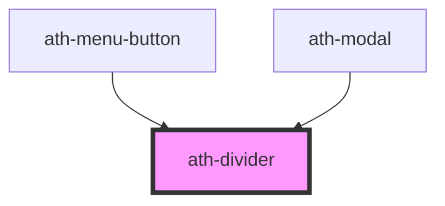

# ath-divider

<!-- Auto Generated Below -->

## Properties

| Property      | Attribute     | Description                | Type                              | Default                       |
| ------------- | ------------- | -------------------------- | --------------------------------- | ----------------------------- |
| `color`       | `color`       | Color of the divider       | `"bold" \| "bolder" \| "boldest"` | `DIVIDER_DEFAULT_COLOR`       |
| `orientation` | `orientation` | Orientation of the divider | `"horizontal" \| "vertical"`      | `DIVIDER_DEFAULT_ORIENTATION` |
| `size`        | `size`        | Size of the divider        | `"md" \| "sm"`                    | `DIVIDER_DEFAULT_SIZE`        |

## Dependencies

### Used by

 - [ath-menu-button](../menu-button)
 - [ath-modal](../modal)

### Graph

----------------------------------------------

*Built with [StencilJS](https://stenciljs.com/)*
