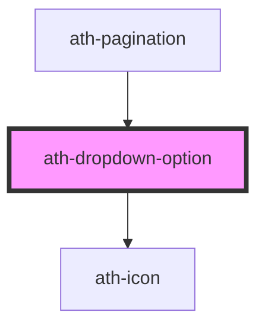

# ath-dropdown-option

<!-- Auto Generated Below -->

## Properties

| Property            | Attribute             | Description                                   | Type      | Default          |
| ------------------- | --------------------- | --------------------------------------------- | --------- | ---------------- |
| `disabled`          | `disabled`            | Si esta deshabilitado                         | `boolean` | `false`          |
| `icon`              | `icon`                | icono para opcion                             | `string`  | `undefined`      |
| `name`              | `name`                | name option                                   | `string`  | `undefined`      |
| `optionGroup`       | `option-group`        | Permite agrupaciones                          | `boolean` | `undefined`      |
| `selected`          | `selected`            | Si esta selecionado                           | `boolean` | `false`          |
| `selectedAriaLabel` | `selected-aria-label` | etiqueta accesible para la opcionseleccionada | `string`  | `'seleccionada'` |
| `text`              | `text`                | texto del option                              | `string`  | `undefined`      |
| `value`             | `value`               | Valor del option                              | `string`  | `undefined`      |

## Events

| Event         | Description | Type                                                 |
| ------------- | ----------- | ---------------------------------------------------- |
| `optSelected` |             | `CustomEvent<{ source: "user" \| "programmatic"; }>` |

## Methods

### `activeDropdownOption() => Promise<void>`

#### Returns

Type: `Promise<void>`

### `filterFound() => Promise<void>`

#### Returns

Type: `Promise<void>`

### `filterNotFound(inputText: any) => Promise<void>`

#### Parameters

| Name        | Type  | Description |
| ----------- | ----- | ----------- |
| `inputText` | `any` |             |

#### Returns

Type: `Promise<void>`

### `noActiveDropdownOption() => Promise<void>`

#### Returns

Type: `Promise<void>`

### `selectOption() => Promise<void>`

#### Returns

Type: `Promise<void>`

### `setSelected(selected: boolean, opts?: { silent?: boolean; source?: "user" | "programmatic"; }) => Promise<void>`

#### Parameters

| Name       | Type                                                       | Description |
| ---------- | ---------------------------------------------------------- | ----------- |
| `selected` | `boolean`                                                  |             |
| `opts`     | `{ silent?: boolean; source?: "user" \| "programmatic"; }` |             |

#### Returns

Type: `Promise<void>`

### `unselectOption() => Promise<void>`

#### Returns

Type: `Promise<void>`

### `updateGroupOption() => Promise<void>`

#### Returns

Type: `Promise<void>`

### `updateMultiselect() => Promise<void>`

#### Returns

Type: `Promise<void>`

## Dependencies

### Used by

 - [ath-pagination](../../pagination)

### Depends on

- [ath-icon](../../icon)

### Graph

----------------------------------------------

*Built with [StencilJS](https://stenciljs.com/)*
