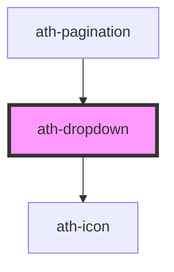

# ath-dropdown

<!-- Auto Generated Below -->

## Properties

| Property             | Attribute              | Description                                                                             | Type                   | Default                               |
| -------------------- | ---------------------- | --------------------------------------------------------------------------------------- | ---------------------- | ------------------------------------- |
| `announceResultText` | `announce-result-text` | Text to announce the items found in search input                                        | `string`               | `'Hay [total] elementos en la lista'` |
| `disabled`           | `disabled`             | Si dropdown esta deshabilitado                                                          | `boolean`              | `false`                               |
| `dropdownAriaLabel`  | `dropdown-aria-label`  | Nombre accesible para el dropdown                                                       | `string`               | `undefined`                           |
| `feedback`           | `feedback`             | Tipo feedback                                                                           | `"error" \| "none"`    | `dropdownFeedbackType.None`           |
| `feedbackText`       | `feedback-text`        | Texto feedback                                                                          | `string`               | `undefined`                           |
| `helperText`         | `helper-text`          | Texto de ayuda                                                                          | `string`               | `undefined`                           |
| `hideRequired`       | `hide-required`        | If true, Do no show required mark for required input                                    | `boolean`              | `false`                               |
| `label`              | `label`                | Label dropdown                                                                          | `string`               | `undefined`                           |
| `multiselect`        | `multiselect`          | Si dropdown es multiseleccion                                                           | `boolean`              | `false`                               |
| `name`               | `name`                 | The name of the combobox. Submitted with the form as part of a name/value pair          | `string`               | `undefined`                           |
| `nochipsText`        | `nochips-text`         | texto cuando multiselect es true, showChips es false y se selecciona una opcion         | `string`               | `undefined`                           |
| `noresultText`       | `noresult-text`        | no result text                                                                          | `string`               | `undefined`                           |
| `open`               | `open`                 | Si dropdown esta abierto                                                                | `boolean`              | `false`                               |
| `overlayMaxHeight`   | `overlay-max-height`   | Altura del overlay del dropdown                                                         | `string`               | `undefined`                           |
| `placeholder`        | `placeholder`          | Placeholder                                                                             | `string`               | `undefined`                           |
| `readonly`           | `readonly`             | Si dropdown es solo lectura                                                             | `boolean`              | `false`                               |
| `required`           | `required`             | Si dropdown es obligatorio                                                              | `boolean`              | `false`                               |
| `search`             | `search`               | Si dropdown tiene bloque de busqueda                                                    | `boolean`              | `false`                               |
| `searchAriaLabel`    | `search-aria-label`    | Texto placeholder del bloque de busqueda                                                | `string`               | `'Buscar'`                            |
| `searchPlaceholder`  | `search-placeholder`   | Texto placeholder del bloque de busqueda                                                | `string`               | `''`                                  |
| `showChips`          | `show-chips`           | Mostrar chips                                                                           | `boolean`              | `false`                               |
| `size`               | `size`                 | Tamaño dropdown                                                                         | `"lg" \| "md" \| "sm"` | `dropdownSize.Md`                     |
| `tooltipText`        | `tooltip-text`         | Texto del tooltip                                                                       | `string`               | `undefined`                           |
| `tooltipWidth`       | `tooltip-width`        | Ancho del tooltip                                                                       | `number`               | `0`                                   |
| `value`              | `value`                | Current value of the form control. Submitted with the form as part of a name/value pair | `string`               | `undefined`                           |
| `width`              | `width`                | Ancho dropdown                                                                          | `string`               | `undefined`                           |

## Events

| Event       | Description                           | Type                            |
| ----------- | ------------------------------------- | ------------------------------- |
| `athBlur`   | Emitted when the combobox loses focus | `CustomEvent<void>`             |
| `athChange` | Emitted when option changed           | `CustomEvent<ActionListItem[]>` |
| `athFocus`  | Emitted when the combobox gains focus | `CustomEvent<void>`             |

## Dependencies

### Used by

 - [ath-pagination](../pagination)

### Depends on

- [ath-icon](../icon)

### Graph

----------------------------------------------

*Built with [StencilJS](https://stenciljs.com/)*
