# ath-icon

<!-- Auto Generated Below -->

## Properties

| Property         | Attribute         | Description                               | Type                                                                                                                        | Default           |
| ---------------- | ----------------- | ----------------------------------------- | --------------------------------------------------------------------------------------------------------------------------- | ----------------- |
| `ariaLabel`      | `aria-label`      | The aria-label attribute of the icon      | `string`                                                                                                                    | `undefined`       |
| `ariaLabelledby` | `aria-labelledby` | The aria-labelledby attribute of the icon | `string`                                                                                                                    | `undefined`       |
| `color`          | `color`           | Color del icon                            | `"accent" \| "default" \| "disabled" \| "error" \| "info" \| "inherit" \| "inverse" \| "primary" \| "success" \| "warning"` | `undefined`       |
| `icon`           | `icon`            | The icon name                             | `string`                                                                                                                    | `undefined`       |
| `size`           | `size`            | The size of the icon                      | `"lg" \| "md" \| "sm" \| "xs"`                                                                                              | `IconSize.Medium` |

## Dependencies

### Used by

 - [ath-accordion-item](../accordion/accordion-item)
 - [ath-alert](../alert)
 - [ath-button](../button)
 - [ath-button-expandable](../button-expandable)
 - [ath-button-link](../button-link)
 - [ath-card](../card)
 - [ath-card-selectable](../card-selectable)
 - [ath-chip-choice](../chip-choice)
 - [ath-chip-dismiss](../chip-dismiss)
 - [ath-collapse-icon](../collapse)
 - [ath-dropdown](../dropdown)
 - [ath-dropdown-option](../dropdown/dropdown-option)
 - [ath-link](../link)
 - [ath-list-item](../list/list-item)
 - [ath-menu-button-item](../menu-button/menu-button-item)
 - [ath-menu-lateral](../menu-lateral)
 - [ath-menu-vertical](../menu-vertical)
 - [ath-section-title](../section-title)
 - [ath-segmented-control-item](../segmented-control/segmented-control-item)
 - [ath-step](../stepper/step)
 - [ath-stepper](../stepper)
 - [ath-table-row](../table/table-row)
 - [ath-tabs](../tabs)
 - [ath-tag](../tag)
 - [ath-tooltip-trigger](../tooltip)

### Graph

```mermaid
graph TD;
  ath-accordion-item --> ath-icon
  ath-alert --> ath-icon
  ath-button --> ath-icon
  ath-button-expandable --> ath-icon
  ath-button-link --> ath-icon
  ath-card --> ath-icon
  ath-card-selectable --> ath-icon
  ath-chip-choice --> ath-icon
  ath-chip-dismiss --> ath-icon
  ath-collapse-icon --> ath-icon
  ath-dropdown --> ath-icon
  ath-dropdown-option --> ath-icon
  ath-link --> ath-icon
  ath-list-item --> ath-icon
  ath-menu-button-item --> ath-icon
  ath-menu-lateral --> ath-icon
  ath-menu-vertical --> ath-icon
  ath-section-title --> ath-icon
  ath-segmented-control-item --> ath-icon
  ath-step --> ath-icon
  ath-stepper --> ath-icon
  ath-table-row --> ath-icon
  ath-tabs --> ath-icon
  ath-tag --> ath-icon
  ath-tooltip-trigger --> ath-icon
  style ath-icon fill:#f9f,stroke:#333,stroke-width:4px
```

----------------------------------------------

*Built with [StencilJS](https://stenciljs.com/)*
