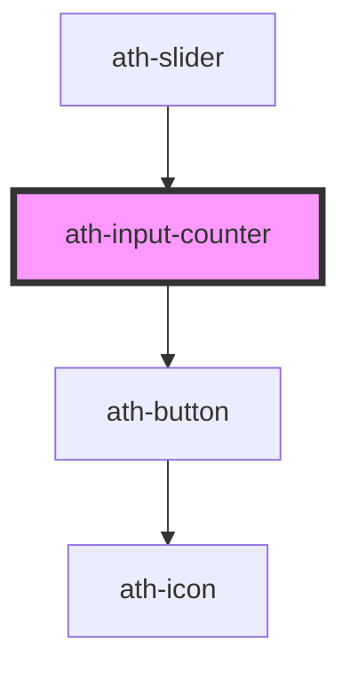

# ath-input-counter

<!-- Auto Generated Below -->

## Properties

| Property         | Attribute          | Description                                                                              | Type                   | Default                          |
| ---------------- | ------------------ | ---------------------------------------------------------------------------------------- | ---------------------- | -------------------------------- |
| `disabled`       | `disabled`         | If true, the user cannot interact with the input.                                        | `boolean`              | `false`                          |
| `feedback`       | `feedback`         | The type of the feedback. If 'error' the error feedback will be shown.                   | `"error" \| "none"`    | `InputCounterFeedbackTypes.None` |
| `feedbackText`   | `feedback-text`    | The message for the feedback.                                                            | `string`               | `undefined`                      |
| `helperText`     | `helper-text`      | Message to help the user fill the input value.                                           | `string`               | `undefined`                      |
| `hideControls`   | `hide-controls`    | If true, the controls are not visible.                                                   | `boolean`              | `false`                          |
| `hideRequired`   | `hide-required`    | If true, the * asterisk will be hidden when the input is required.                       | `boolean`              | `false`                          |
| `inputAriaLabel` | `input-aria-label` | The aria-label attribute of the input.                                                   | `string`               | `undefined`                      |
| `label`          | `label`            | Represents the caption of the input.                                                     | `string`               | `undefined`                      |
| `max`            | `max`              | Represents the maximum number of the input.                                              | `number`               | `undefined`                      |
| `min`            | `min`              | Represents the minimum number of the input.                                              | `number`               | `undefined`                      |
| `name`           | `name`             | The name of the input. Submitted with the form as part of a name/value pair.             | `string`               | `undefined`                      |
| `placeholder`    | `placeholder`      | Instructional text that shows before the input has a value.                              | `string`               | `undefined`                      |
| `readonly`       | `readonly`         | If true, the user cannot modify the value.                                               | `boolean`              | `false`                          |
| `required`       | `required`         | If true, the user must fill in a value before submitting a form.                         | `boolean`              | `false`                          |
| `size`           | `size`             | Specifies the size of the input.                                                         | `"lg" \| "md" \| "sm"` | `InputCounterSizes.Medium`       |
| `step`           | `step`             | Specifies the interval between legal numbers in an <input> element.                      | `number`               | `1`                              |
| `tooltipText`    | `tooltip-text`     | Specifies text for tooltip.                                                              | `string`               | `undefined`                      |
| `tooltipWidth`   | `tooltip-width`    | Specifies width for tooltip.                                                             | `number`               | `undefined`                      |
| `unit`           | `unit`             | Specifies the unit for the input.                                                        | `string`               | `undefined`                      |
| `unitAriaLabel`  | `unit-aria-label`  | Specifies the accesible unit for the input.                                              | `string`               | `undefined`                      |
| `value`          | `value`            | Current value of the form control. Submitted with the form as part of a name/value pair. | `string`               | `undefined`                      |

## Events

| Event       | Description                                                                                | Type                  |
| ----------- | ------------------------------------------------------------------------------------------ | --------------------- |
| `athBlur`   | Emitted when the input loses focus.                                                        | `CustomEvent<void>`   |
| `athChange` | Emitted when the value has changed. This event doesn't fire until the control loses focus. | `CustomEvent<string>` |
| `athFocus`  | Emitted when the input gains focus.                                                        | `CustomEvent<void>`   |
| `athInput`  | Emitted every time the value is updated by introducing a change.                           | `CustomEvent<string>` |

## Dependencies

### Used by

 - [ath-slider](../slider)

### Depends on

- [ath-button](../button)

### Graph

----------------------------------------------

*Built with [StencilJS](https://stenciljs.com/)*
