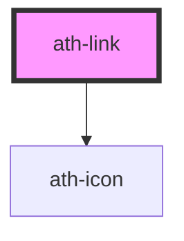

# ath-link

<!-- Auto Generated Below -->

## Properties

| Property          | Attribute          | Description                                                                                | Type                                     | Default            |
| ----------------- | ------------------ | ------------------------------------------------------------------------------------------ | ---------------------------------------- | ------------------ |
| `ariaDescribedby` | `aria-describedby` | aria-describedby para link                                                                 | `string`                                 | `undefined`        |
| `ariaLabel`       | `aria-label`       | aria-label para link                                                                       | `string`                                 | `undefined`        |
| `ariaLabelledby`  | `aria-labelledby`  | aria-labelledby para link                                                                  | `string`                                 | `undefined`        |
| `disabled`        | `disabled`         | Indica si el link esta deshabilitado                                                       | `boolean`                                | `undefined`        |
| `externalLabel`   | `external-label`   | Additional text to be appended to the aria-label to indicate that this is an external link | `string`                                 | `undefined`        |
| `icon`            | `icon`             | Indica el icono a usar                                                                     | `string`                                 | `undefined`        |
| `iconAriaLabel`   | `icon-aria-label`  | Indica el aria-label para icono                                                            | `string`                                 | `undefined`        |
| `linkHref`        | `link-href`        | Url del destino                                                                            | `string`                                 | `undefined`        |
| `linkTarget`      | `link-target`      | Target para indicar donde se abrira                                                        | `"blank" \| "parent" \| "self" \| "top"` | `linkTarget.Blank` |
| `size`            | `size`             | Tamaño link                                                                                | `"lg" \| "md" \| "sm"`                   | `linkSize.Md`      |
| `underline`       | `underline`        | Opcion del subrayado                                                                       | `boolean`                                | `true`             |

## Events

| Event      | Description                       | Type                |
| ---------- | --------------------------------- | ------------------- |
| `athBlur`  | Emitted when the link loses focus | `CustomEvent<void>` |
| `athClick` | Emitted when the link is clicked  | `CustomEvent<void>` |
| `athFocus` | Emitted when the lin gains focus  | `CustomEvent<void>` |

## Dependencies

### Depends on

- [ath-icon](../icon)

### Graph

----------------------------------------------

*Built with [StencilJS](https://stenciljs.com/)*
