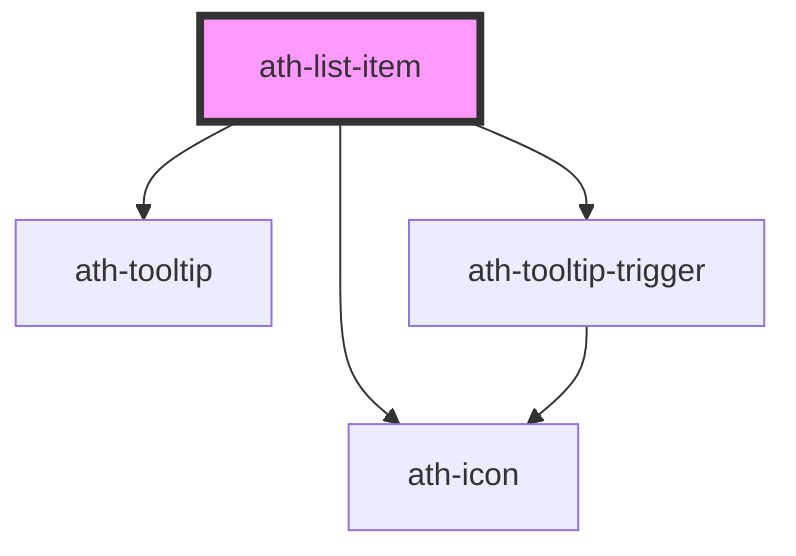

# ath-list-item

<!-- Auto Generated Below -->

## Properties

| Property          | Attribute           | Description                                                                                | Type                                     | Default                       |
| ----------------- | ------------------- | ------------------------------------------------------------------------------------------ | ---------------------------------------- | ----------------------------- |
| `athAriaLabel`    | `ath-aria-label`    | The aria-label attribute of the clicable item                                              | `string`                                 | `undefined`                   |
| `clickable`       | `clickable`         | ListItem is clickable                                                                      | `boolean`                                | `false`                       |
| `description`     | `description`       | List item description                                                                      | `string`                                 | `undefined`                   |
| `disabled`        | `disabled`          | List item state disabled, only works if clickable is true                                  | `boolean`                                | `false`                       |
| `externalLabel`   | `external-label`    | Additional text to be appended to the aria-label to indicate that this is an external link | `string`                                 | `'Se abre una ventana nueva'` |
| `hasDivider`      | `has-divider`       | List item divider. If user doesn't inform it, its informed from parent list                | `boolean`                                | `undefined`                   |
| `headingLevel`    | `heading-level`     | Heading level for the title                                                                | `number`                                 | `4`                           |
| `headingText`     | `heading-text`      | List item title                                                                            | `string`                                 | `undefined`                   |
| `href`            | `href`              | URL when clickable is true                                                                 | `string`                                 | `undefined`                   |
| `orientation`     | `orientation`       | List item orientation. Its informed from parent list                                       | `"horizontal" \| "vertical"`             | `ListOrientation.Vertical`    |
| `rel`             | `rel`               | Type of rel to url                                                                         | `string`                                 | `undefined`                   |
| `size`            | `size`              | List item size. Its informed from parent list                                              | `"lg" \| "md" \| "sm" \| "xs"`           | `ListSizes.Medium`            |
| `subtitle`        | `subtitle`          | List item subtitle                                                                         | `string`                                 | `undefined`                   |
| `target`          | `target`            | Type of target to url                                                                      | `"blank" \| "parent" \| "self" \| "top"` | `ListLinkTarget.Self`         |
| `tooltip`         | `tooltip`           | List item tooltip                                                                          | `string`                                 | `undefined`                   |
| `tooltipMaxWidth` | `tooltip-max-width` | Tooltip max-width                                                                          | `number`                                 | `240`                         |

## Events

| Event      | Description                      | Type                |
| ---------- | -------------------------------- | ------------------- |
| `athClick` | Emitted when listItem is clicked | `CustomEvent<void>` |

## Shadow Parts

| Part              | Description |
| ----------------- | ----------- |
| `"center-detail"` |             |

## Dependencies

### Depends on

- [ath-tooltip](../../tooltip)
- [ath-tooltip-trigger](../../tooltip)
- [ath-icon](../../icon)

### Graph

----------------------------------------------

*Built with [StencilJS](https://stenciljs.com/)*
