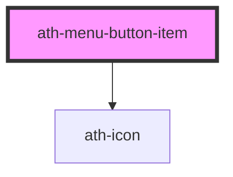

# ath-menu-button-item

<!-- Auto Generated Below -->

## Properties

| Property       | Attribute        | Description                               | Type      | Default     |
| -------------- | ---------------- | ----------------------------------------- | --------- | ----------- |
| `disabled`     | `disabled`       | Weather the button is disabled            | `boolean` | `undefined` |
| `groupName`    | `group-name`     | The name of the grout the item belongs to | `string`  | `undefined` |
| `icon`         | `icon`           | The icon of the menu-button-item          | `string`  | `undefined` |
| `itemTabIndex` | `item-tab-index` |                                           | `number`  | `-1`        |
| `name`         | `name`           | name option                               | `string`  | `undefined` |
| `text`         | `text`           | The text of the menu-button-item          | `string`  | `undefined` |

## Events

| Event         | Description                                             | Type                                        |
| ------------- | ------------------------------------------------------- | ------------------------------------------- |
| `athSelected` | Emitted when the item is clicked and triggers an action | `CustomEvent<HTMLAthMenuButtonItemElement>` |

## Dependencies

### Depends on

- [ath-icon](../../icon)

### Graph

----------------------------------------------

*Built with [StencilJS](https://stenciljs.com/)*
