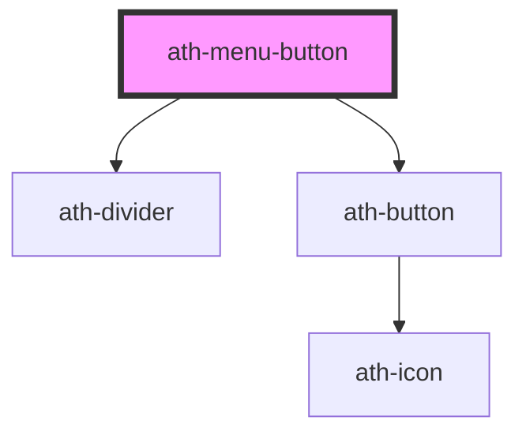

# ath-menu-button

<!-- Auto Generated Below -->

## Properties

| Property           | Attribute            | Description                                            | Type                           | Default               |
| ------------------ | -------------------- | ------------------------------------------------------ | ------------------------------ | --------------------- |
| `alignment`        | `alignment`          | The overlay's position relative to the origin          | `"left" \| "right"`            | `Alignment.Left`      |
| `athAriaLabel`     | `ath-aria-label`     | The accesible label of the menu-button                 | `string`                       | `undefined`           |
| `autofocus`        | `autofocus`          | Weather the button is focused by default               | `boolean`                      | `undefined`           |
| `clear`            | `clear`              | The clear of the button (background and border color)  | `boolean`                      | `undefined`           |
| `color`            | `color`              | The color variant of the button                        | `"primary" \| "secondary"`     | `ButtonColor.Primary` |
| `disabled`         | `disabled`           | The button is disabled                                 | `boolean`                      | `undefined`           |
| `icon`             | `icon`               | The code of the button's icon (used with iconPosition) | `string`                       | `'placeholder'`       |
| `open`             | `open`               | Wheather the menu is open by default                   | `boolean`                      | `undefined`           |
| `overlayMaxHeight` | `overlay-max-height` | Altura del overlay del menu                            | `string`                       | `undefined`           |
| `size`             | `size`               | The size of the button                                 | `"lg" \| "md" \| "sm" \| "xs"` | `ButtonSize.Medium`   |

## Events

| Event       | Description                     | Type                                                   |
| ----------- | ------------------------------- | ------------------------------------------------------ |
| `athAction` | Emitted when an item is clicked | `CustomEvent<{ item: HTMLAthMenuButtonItemElement; }>` |

## Dependencies

### Depends on

- [ath-divider](../divider)
- [ath-button](../button)

### Graph

----------------------------------------------

*Built with [StencilJS](https://stenciljs.com/)*
