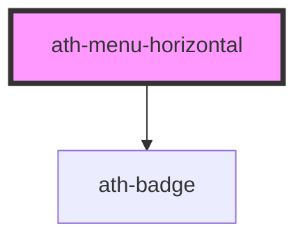

# ath-menu-horizontal

<!-- Auto Generated Below -->

## Properties

| Property       | Attribute        | Description                                | Type                             | Default     |
| -------------- | ---------------- | ------------------------------------------ | -------------------------------- | ----------- |
| `athAriaLabel` | `ath-aria-label` | The accessible label for the menu          | `string`                         | `undefined` |
| `hasDivider`   | `has-divider`    | Whether the menu has a divider below       | `boolean`                        | `true`      |
| `items`        | `items`          | Items to generate using the imperative way | `MenuHorizontalItem[] \| string` | `undefined` |

## Events

| Event         | Description                                                         | Type                                                                                                                                                                                                                                       |
| ------------- | ------------------------------------------------------------------- | ------------------------------------------------------------------------------------------------------------------------------------------------------------------------------------------------------------------------------------------ |
| `athSelected` | Emitted when an item is selected with the MenuHorizontalItem object | `CustomEvent<{ badgeLabel?: string; badgeMax?: number; badgeValue?: number; disabled?: boolean; externalLabel?: string; href?: string; id: string; label: string; rel?: string; selected?: boolean; target?: TargetTypes; value?: any; }>` |

## Dependencies

### Depends on

- [ath-badge](../badge)

### Graph

----------------------------------------------

*Built with [StencilJS](https://stenciljs.com/)*
