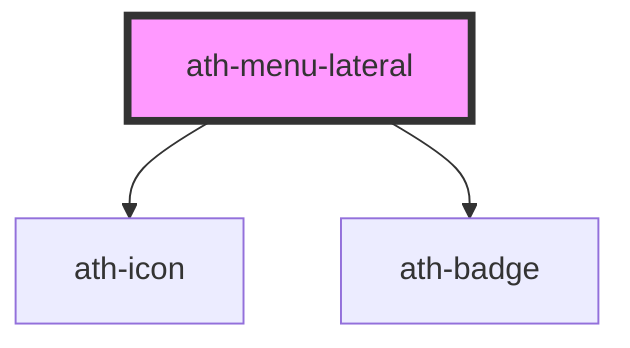

# ath-menu-lateral

<!-- Auto Generated Below -->

## Properties

| Property | Attribute | Description                        | Type                          | Default     |
| -------- | --------- | ---------------------------------- | ----------------------------- | ----------- |
| `items`  | `items`   | (JSON) Object of items to generate | `MenuLateralItem[] \| string` | `undefined` |

## Events

| Event         | Description | Type                                                                                               |
| ------------- | ----------- | -------------------------------------------------------------------------------------------------- |
| `athSelected` | Events      | `CustomEvent<{ item: HTMLAthMenuLateralItemActionElement \| HTMLAthMenuLateralItemLinkElement; }>` |

## Dependencies

### Depends on

- [ath-icon](../icon)
- [ath-badge](../badge)

### Graph

----------------------------------------------

*Built with [StencilJS](https://stenciljs.com/)*
