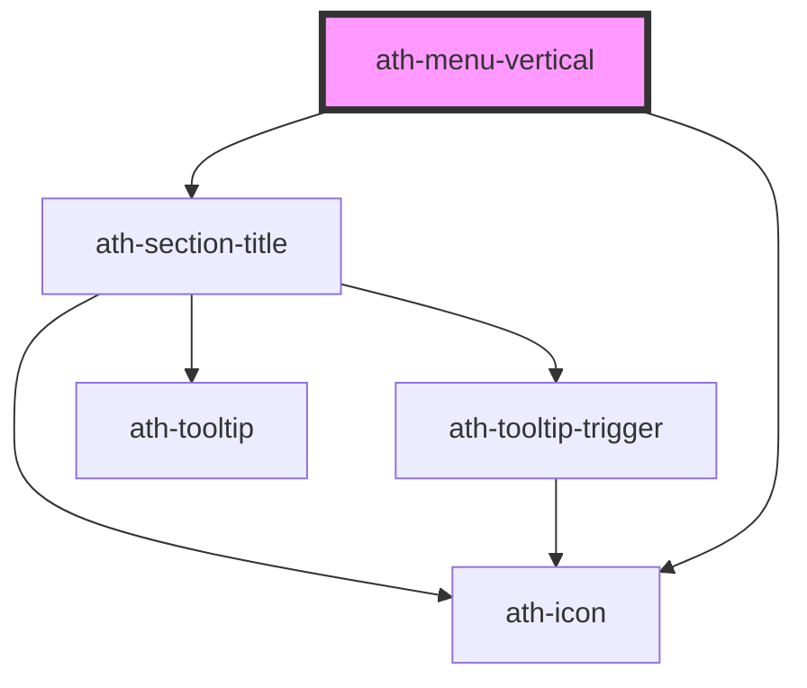

# ath-menu-vertical

<!-- Auto Generated Below -->

## Properties

| Property     | Attribute    | Description            | Type                       | Default                           |
| ------------ | ------------ | ---------------------- | -------------------------- | --------------------------------- |
| `appearance` | `appearance` | Appearance of the menu | `"primary" \| "secondary"` | `MenuVerticalAppearances.Primary` |

## Events

| Event         | Description                                   | Type                                                                                                                                                                                                                                            |
| ------------- | --------------------------------------------- | ----------------------------------------------------------------------------------------------------------------------------------------------------------------------------------------------------------------------------------------------- |
| `athSelected` | Emitted when link or action Button is clicked | `CustomEvent<MenuItemBase & { tagName: "ath-MENU-VERTICAL-ITEM-ACTION"; } \| MenuItemBase & { tagName: "ath-MENU-VERTICAL-ITEM-LINK"; href?: string; target?: "self" \| "parent" \| "blank" \| "top"; rel?: string; externalLabel?: string; }>` |

## Dependencies

### Depends on

- [ath-section-title](../section-title)
- [ath-icon](../icon)

### Graph

----------------------------------------------

*Built with [StencilJS](https://stenciljs.com/)*
