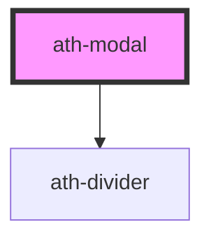

# ath-modal

<!-- Auto Generated Below -->

## Properties

| Property            | Attribute             | Description                                                                          | Type                                          | Default                 |
| ------------------- | --------------------- | ------------------------------------------------------------------------------------ | --------------------------------------------- | ----------------------- |
| `appearance`        | `appearance`          | Indicates the illustration used when the prop isAlert is set to true                 | `"error" \| "info" \| "success" \| "warning"` | `ModalAppearance.Error` |
| `autofocus`         | `autofocus`           | Indicates whether the modal should automatically focus the first interactive element | `boolean`                                     | `true`                  |
| `clickOutsideClose` | `click-outside-close` | Indicates whether the modal should close when clicking outside                       | `boolean`                                     | `false`                 |
| `closeAriaLabel`    | `close-aria-label`    | Accessible text for the close (X) button                                             | `string`                                      | `undefined`             |
| `fullScreen`        | `full-screen`         | Indicates whether the modal will occupy the full screen                              | `boolean`                                     | `false`                 |
| `hasClose`          | `has-close`           | Indicates whether the modal has a close (X) button                                   | `boolean`                                     | `true`                  |
| `hasDivider`        | `has-divider`         | Indicates whether there is a divider between the header and the slots                | `boolean`                                     | `false`                 |
| `headingLevel`      | `heading-level`       | Indicates the heading level of the title                                             | `number`                                      | `2`                     |
| `headingText`       | `heading-text`        | Indicates the title text                                                             | `string`                                      | `undefined`             |
| `isAlert`           | `is-alert`            | Indicates whether the modal has role "Alert", and interrupts the screen reader flow  | `boolean`                                     | `false`                 |
| `maxHeight`         | `max-height`          | Indicates the maximum height of the modal                                            | `string`                                      | `undefined`             |
| `maxWidth`          | `max-width`           | Indicates the maximum width of the modal                                             | `string`                                      | `undefined`             |
| `open`              | `open`                | Indicates whether the modal is displayed by default                                  | `boolean`                                     | `false`                 |
| `size`              | `size`                | Differentiates the modal size between sm and md                                      | `"md" \| "sm"`                                | `ModalSize.Medium`      |
| `subtitleText`      | `subtitle-text`       | Indicates the subtitle text                                                          | `string`                                      | `undefined`             |

## Events

| Event       | Description                      | Type                |
| ----------- | -------------------------------- | ------------------- |
| `athClosed` | Emitted when the modal is closed | `CustomEvent<void>` |
| `athOpened` | Emitted when the modal is opened | `CustomEvent<void>` |

## Methods

### `closeModal() => Promise<void>`

Method to close the modal

#### Returns

Type: `Promise<void>`

### `openModal() => Promise<void>`

Method to open the modal

#### Returns

Type: `Promise<void>`

## Dependencies

### Depends on

- [ath-divider](../divider)

### Graph

----------------------------------------------

*Built with [StencilJS](https://stenciljs.com/)*
