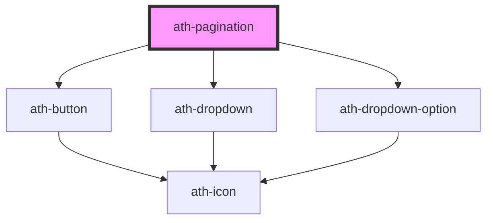

# ath-pagination

<!-- Auto Generated Below -->

## Properties

| Property          | Attribute           | Description                                                                    | Type      | Default                      |
| ----------------- | ------------------- | ------------------------------------------------------------------------------ | --------- | ---------------------------- |
| `athAriaLabel`    | `ath-aria-label`    | ARIA label for the pagination component.                                       | `string`  | `'Paginación de resultados'` |
| `currentPage`     | `current-page`      | Current active page number in the pagination.                                  | `number`  | `1`                          |
| `disabled`        | `disabled`          | Determines whether the Pagination is disabled.                                 | `boolean` | `false`                      |
| `itemsPerPage`    | `items-per-page`    | Defines the number of items displayed per page in the pagination.              | `number`  | `undefined`                  |
| `itemsSelector`   | `items-selector`    | Defines the selectable options for the number of items of the dropdown.        | `string`  | `'[5, 10, 15]'`              |
| `noEndButtons`    | `no-end-buttons`    | Hide the buttons to navigate to the first and last pages.                      | `boolean` | `false`                      |
| `noItemsCount`    | `no-items-count`    | Determines whether the item count message is displayed in the pagination.      | `boolean` | `false`                      |
| `noItemsSelector` | `no-items-selector` | Determines whether a dropdown is shown to select the number of items per page. | `boolean` | `false`                      |
| `noJumpButtons`   | `no-jump-buttons`   | Hide the buttons to jump to the previous or next pages.                        | `boolean` | `false`                      |
| `totalItems`      | `total-items`       | Total number of items over all pages.                                          | `number`  | `undefined`                  |

## Events

| Event                   | Description                                                                            | Type                  |
| ----------------------- | -------------------------------------------------------------------------------------- | --------------------- |
| `athItemsPerPageChange` | Event emitted when the items per page changes. Emits the new items per page as detail. | `CustomEvent<number>` |
| `athPaginate`           | Event emitted when the page changes. Emits the new page number as detail.              | `CustomEvent<number>` |

## Dependencies

### Depends on

- [ath-button](../button)
- [ath-dropdown](../dropdown)
- [ath-dropdown-option](../dropdown/dropdown-option)

### Graph

----------------------------------------------

*Built with [StencilJS](https://stenciljs.com/)*
