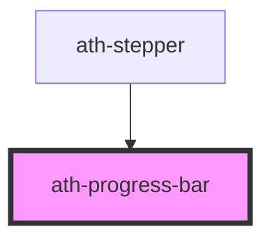

# ath-progress-bar

<!-- Auto Generated Below -->

## Properties

| Property         | Attribute         | Description                                              | Type                  | Default                           |
| ---------------- | ----------------- | -------------------------------------------------------- | --------------------- | --------------------------------- |
| `athAriaLabel`   | `ath-aria-label`  | Aria Label                                               | `string`              | `undefined`                       |
| `infinite`       | `infinite`        | Infinite determines if the progress bar is a loop or not | `boolean`             | `false`                           |
| `labelAlignment` | `label-alignment` | Change label alignment                                   | `"inline" \| "stack"` | `ProgressBarLabelAlignment.Stack` |
| `labelLeft`      | `label-left`      | Text of the label left                                   | `string`              | `undefined`                       |
| `labelRight`     | `label-right`     | Text of the label right                                  | `string`              | `undefined`                       |
| `max`            | `max`             | Number max of progress bar                               | `number`              | `100`                             |
| `min`            | `min`             | Number min of progress bar                               | `number`              | `0`                               |
| `value`          | `value`           | Value of the progress bar                                | `number`              | `undefined`                       |
| `valueText`      | `value-text`      | Value text of the progress bar                           | `string`              | `undefined`                       |

## Dependencies

### Used by

 - [ath-stepper](../stepper)

### Graph

----------------------------------------------

*Built with [StencilJS](https://stenciljs.com/)*
