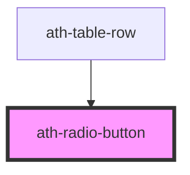

# ath-radio-button

<!-- Auto Generated Below -->

## Properties

| Property    | Attribute    | Description                            | Type      | Default     |
| ----------- | ------------ | -------------------------------------- | --------- | ----------- |
| `ariaLabel` | `aria-label` | Accessible text (aria-label)           | `string`  | `undefined` |
| `checked`   | `checked`    | Indicates if it is checked by default  | `boolean` | `false`     |
| `disabled`  | `disabled`   | Indicates if it is disabled            | `boolean` | `false`     |
| `label`     | `label`      | Label text                             | `string`  | `undefined` |
| `name`      | `name`       | Indicates the name of the radioButton  | `string`  | `undefined` |
| `readonly`  | `readonly`   | Indicates if it is read-only           | `boolean` | `false`     |
| `value`     | `value`      | Indicates the value of the radioButton | `string`  | `undefined` |

## Events

| Event       | Description                                       | Type                                                |
| ----------- | ------------------------------------------------- | --------------------------------------------------- |
| `athBlur`   | Emitted when the radio-button loses focus         | `CustomEvent<void>`                                 |
| `athChange` | Emitted when there is a change in the input state | `CustomEvent<{ checked: boolean; value: string; }>` |
| `athFocus`  | Emitted when the radio-button receives focus      | `CustomEvent<void>`                                 |

## Methods

### `setFocus() => Promise<void>`

#### Returns

Type: `Promise<void>`

### `setTabindex(tabIndex: any) => Promise<void>`

#### Parameters

| Name       | Type  | Description |
| ---------- | ----- | ----------- |
| `tabIndex` | `any` |             |

#### Returns

Type: `Promise<void>`

### `unCheck() => Promise<void>`

#### Returns

Type: `Promise<void>`

## Dependencies

### Used by

 - [ath-table-row](../table/table-row)

### Graph

----------------------------------------------

*Built with [StencilJS](https://stenciljs.com/)*
