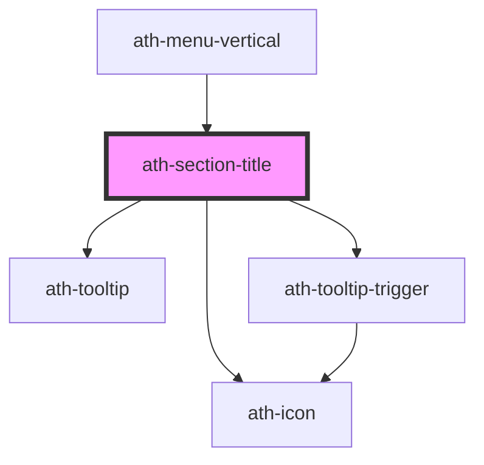

# ath-section-title

<!-- Auto Generated Below -->

## Properties

| Property          | Attribute          | Description                                                                                                              | Type                                 | Default                      |
| ----------------- | ------------------ | ------------------------------------------------------------------------------------------------------------------------ | ------------------------------------ | ---------------------------- |
| `collapsable`     | `collapsable`      | 'The 'Section title' can become a button that shows or hides the content of the 'Collapse' component.                    | `boolean`                            | `undefined`                  |
| `collapseTarget`  | `collapse-target`  | Identifier of the 'Collapse' component whose visibility is controlled by this 'Section title'.                           | `string`                             | `undefined`                  |
| `color`           | `color`            | Color assigned to the decorative element and the 'overline' text.                                                        | `"accent" \| "primary"`              | `SectionTitleColor.Primary`  |
| `headingLevel`    | `heading-level`    | Heading level assigned to the title. If 0, a 
 tag is assigned. Values between 1 and 6 correspond to <h1> ... <h6>.    | `number`                             | `4`                          |
| `headingOverline` | `heading-overline` | Heading level assigned to the overline. If 0, a 
 tag is assigned. Values between 1 and 6 correspond to <h1> ... <h6>. | `number`                             | `0`                          |
| `headingSize`     | `heading-size`     | Indicates the heading size for the heading text.                                                                         | `"lg" \| "md" \| "sm"`               | `HeadingSize.Sm`             |
| `headingText`     | `heading-text`     | Section title.                                                                                                           | `string`                             | `undefined`                  |
| `icon`            | `icon`             | The code of the Section Title's icon (used with type Icon)                                                               | `string`                             | `undefined`                  |
| `overline`        | `overline`         | Text above the title, usually used to categorize the content.                                                            | `string`                             | `undefined`                  |
| `pictogram`       | `pictogram`        | The code of the Section Title's pictogram (used with type Pictogram)                                                     | `string`                             | `undefined`                  |
| `tooltip`         | `tooltip`          | Tooltip text to be included.                                                                                             | `string`                             | `''`                         |
| `tooltipLabel`    | `tooltip-label`    | Tooltip aria-label.                                                                                                      | `string`                             | `'Más información'`          |
| `type`            | `type`             | Option assigned to the decorative element.                                                                               | `"default" \| "icon" \| "pictogram"` | `SectionTitleOption.Default` |

## Events

| Event               | Description                                                 | Type                  |
| ------------------- | ----------------------------------------------------------- | --------------------- |
| `athToggleCollapse` | Emitted when the 'Collapse' component collapses or expands. | `CustomEvent<string>` |

## Dependencies

### Used by

 - [ath-menu-vertical](../menu-vertical)

### Depends on

- [ath-icon](../icon)
- [ath-tooltip](../tooltip)
- [ath-tooltip-trigger](../tooltip)

### Graph

----------------------------------------------

*Built with [StencilJS](https://stenciljs.com/)*
