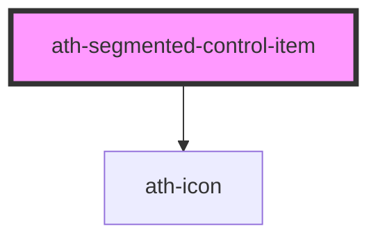

# ath-segmented-control-item

<!-- Auto Generated Below -->

## Properties

| Property       | Attribute       | Description                                                     | Type                                         | Default                                  |
| -------------- | --------------- | --------------------------------------------------------------- | -------------------------------------------- | ---------------------------------------- |
| `color`        | `color`         | Size of the segmented control item                              | `"primary" \| "secondary"`                   | `SegmentedControlColors.Primary`         |
| `disabled`     | `disabled`      | The segmented control is disabled                               | `boolean`                                    | `false`                                  |
| `icon`         | `icon`          | The code of the button's icon (used with iconPosition)          | `string`                                     | `undefined`                              |
| `iconPosition` | `icon-position` | Icon position of the segmented control item                     | `"icon-only" \| "left" \| "none" \| "right"` | `SegmentedControlItemIconPositions.None` |
| `selected`     | `selected`      | The segmented control item is selected                          | `boolean`                                    | `false`                                  |
| `size`         | `size`          | Size of the segmented control item                              | `"lg" \| "md" \| "sm" \| "xl"`               | `SegmentedControlSizes.Medium`           |
| `type`         | `type`          | The type of the control                                         | `"action" \| "select"`                       | `SegmentedControlTypes.Select`           |
| `value`        | `value`         | The value for a Segmented Control with type select (role radio) | `string`                                     | `undefined`                              |

## Events

| Event       | Description                                         | Type                                  |
| ----------- | --------------------------------------------------- | ------------------------------------- |
| `athChange` | Emitted when the segmented control item is selected | `CustomEvent<{ selected: boolean; }>` |
| `athFocus`  | Emitted when the segmented control item is focus    | `CustomEvent<void>`                   |

## Methods

### `setFocus() => Promise<void>`

#### Returns

Type: `Promise<void>`

### `setTabindex(index: number) => Promise<void>`

#### Parameters

| Name    | Type     | Description |
| ------- | -------- | ----------- |
| `index` | `number` |             |

#### Returns

Type: `Promise<void>`

### `unSelectItem() => Promise<void>`

#### Returns

Type: `Promise<void>`

## Dependencies

### Depends on

- [ath-icon](../../icon)

### Graph

----------------------------------------------

*Built with [StencilJS](https://stenciljs.com/)*
