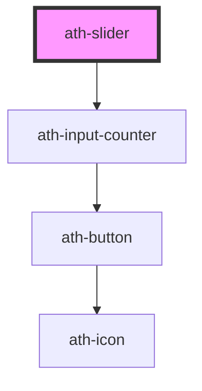

# ath-slider

<!-- Auto Generated Below -->

## Properties

| Property          | Attribute          | Description                                                                              | Type                                 | Default                                |
| ----------------- | ------------------ | ---------------------------------------------------------------------------------------- | ------------------------------------ | -------------------------------------- |
| `counterWidth`    | `counter-width`    | The ath-input-counter width.                                                             | `string`                             | `'auto'`                               |
| `detailFirst`     | `detail-first`     | Detail text at the left of the slider                                                    | `string`                             | `undefined`                            |
| `detailLast`      | `detail-last`      | Detail text at the right of the slider                                                   | `string`                             | `undefined`                            |
| `disabled`        | `disabled`         | If true, the user cannot interact with the slider and the inputs.                        | `boolean`                            | `false`                                |
| `feedback`        | `feedback`         | The type of the feedback. If 'error' the error feedback will be shown.                   | `"error" \| "none"`                  | `SliderFeedbackTypes.None`             |
| `feedbackCounter` | `feedback-counter` | Feedback error for input counter if is from, to, both or none.                           | `"both" \| "from" \| "none" \| "to"` | `SliderFeedbackErrorCounterTypes.None` |
| `feedbackText`    | `feedback-text`    | The message for the feedback.                                                            | `string`                             | `undefined`                            |
| `fromAriaLabel`   | `from-aria-label`  | The aria-label attribute of the first input-counter.                                     | `string`                             | `undefined`                            |
| `groupAriaLabel`  | `group-aria-label` | The aria-label attribute of the slider.                                                  | `string`                             | `undefined`                            |
| `helperText`      | `helper-text`      | Message to help the user fill the input value.                                           | `string`                             | `undefined`                            |
| `labelGroup`      | `label-group`      | Label slider                                                                             | `string`                             | `undefined`                            |
| `max`             | `max`              | Represents the maximum number of the input & slider.                                     | `number`                             | `100`                                  |
| `min`             | `min`              | Represents the minimum number of the input & slider.                                     | `number`                             | `0`                                    |
| `name`            | `name`             | The name of the slider. Submitted with the form as part of a name/value pair             | `string`                             | `undefined`                            |
| `readonly`        | `readonly`         | If true, the user cannot modify the value.                                               | `boolean`                            | `false`                                |
| `required`        | `required`         | If true, the user must fill in a value before submitting a form.                         | `boolean`                            | `false`                                |
| `showRequired`    | `show-required`    | If true, the * asterisk will be show when required = true.                               | `boolean`                            | `true`                                 |
| `step`            | `step`             | Specifies the interval between legal numbers in an <input> element & slider.             | `number`                             | `1`                                    |
| `stepped`         | `stepped`          | If true show step marks.                                                                 | `boolean`                            | `false`                                |
| `toAriaLabel`     | `to-aria-label`    | The aria-label attribute of the second input-counter.                                    | `string`                             | `undefined`                            |
| `tooltipText`     | `tooltip-text`     | Specifies text for tooltip.                                                              | `string`                             | `undefined`                            |
| `type`            | `type`             | The type of slider. if range shows two handles to select between two numbers.            | `"default" \| "range"`               | `SliderTypes.Default`                  |
| `unit`            | `unit`             | Specifies the unit for the input.                                                        | `string`                             | `undefined`                            |
| `value`           | `value`            | Current value of the form control. Submitted with the form as part of a name/value pair. | `string`                             | `this.min.toString()`                  |
| `valueText`       | `value-text`       | The aria-valuetext attribute for slider.                                                 | `string`                             | `undefined`                            |
| `width`           | `width`            | Specifies the width for slider.                                                          | `string`                             | `undefined`                            |

## Events

| Event       | Description                         | Type                  |
| ----------- | ----------------------------------- | --------------------- |
| `athBlur`   | Emitted when the slider loses focus | `CustomEvent<void>`   |
| `athChange` | Emitted when the value has changed. | `CustomEvent<string>` |
| `athFocus`  | Emitted when the slider gains focus | `CustomEvent<void>`   |

## Dependencies

### Depends on

- [ath-input-counter](../input-counter)

### Graph

----------------------------------------------

*Built with [StencilJS](https://stenciljs.com/)*
