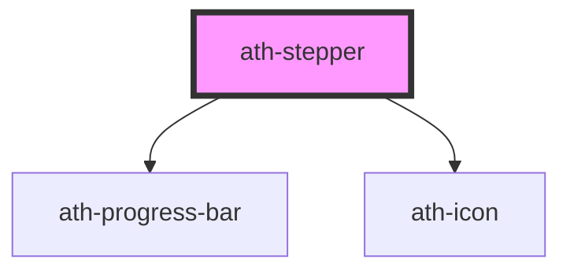

# ath-stepper

<!-- Auto Generated Below -->

## Properties

| Property          | Attribute           | Description                                                                                                | Type                         | Default                         |
| ----------------- | ------------------- | ---------------------------------------------------------------------------------------------------------- | ---------------------------- | ------------------------------- |
| `ariaLiveMessage` | `aria-live-message` | Defines the message for screen readers when changing the step. Only applied on non-interactive steps       | `string`                     | `'Paso actual [number]'`        |
| `athAriaLabel`    | `ath-aria-label`    | Defines the accessible text for the step                                                                   | `string`                     | `undefined`                     |
| `athRole`         | `ath-role`          | Indicates the role of the step                                                                             | `"button" \| "link"`         | `StepRole.Button`               |
| `clickable`       | `clickable`         | Indicates if the steps are interactive                                                                     | `boolean`                    | `true`                          |
| `collapseLabel`   | `collapse-label`    | Indicates the custom accessible text for the chevron to collapse                                           | `string`                     | `'Colapsar paso [number]'`      |
| `completedLabel`  | `completed-label`   | Specifies the accessible text for the CHECK indicator of completion, which will be injected into the steps | `string`                     | `'Completado'`                  |
| `errorLabel`      | `error-label`       | Specifies the accessible text for the error indicator in steps                                             | `string`                     | `'Error'`                       |
| `expandLabel`     | `expand-label`      | Indicates the custom accessible text for the chevron to expand                                             | `string`                     | `'Expandir paso [number]'`      |
| `headingIcon`     | `heading-icon`      | Indicates the icon to use in the title                                                                     | `string`                     | `undefined`                     |
| `headingText`     | `heading-text`      | Indicates the title of the stepper                                                                         | `string`                     | `undefined`                     |
| `orientation`     | `orientation`       | Indicates the orientation of the stepper                                                                   | `"horizontal" \| "vertical"` | `StepperOrientation.Horizontal` |
| `readonly`        | `readonly`          | Indicates if the all the steps are read-only                                                               | `boolean`                    | `false`                         |
| `size`            | `size`              | Indicates the size of the steps                                                                            | `"md" \| "sm"`               | `StepperSize.Medium`            |
| `startFrom`       | `start-from`        | Indicates the number of the first step                                                                     | `number`                     | `1`                             |

## Events

| Event       | Description | Type                              |
| ----------- | ----------- | --------------------------------- |
| `athSelect` |             | `CustomEvent<HTMLAthStepElement>` |

## Dependencies

### Depends on

- [ath-progress-bar](../progress-bar)
- [ath-icon](../icon)

### Graph

----------------------------------------------

*Built with [StencilJS](https://stenciljs.com/)*
