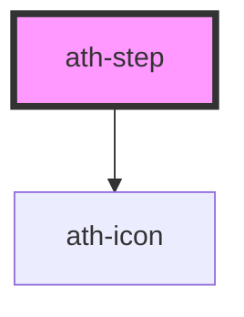

# ath-step

<!-- Auto Generated Below -->

## Properties

| Property          | Attribute           | Description                                                                                                      | Type                 | Default             |
| ----------------- | ------------------- | ---------------------------------------------------------------------------------------------------------------- | -------------------- | ------------------- |
| `actionText`      | `action-text`       | Defines the action text                                                                                          | `string`             | `undefined`         |
| `alignment`       | `alignment`         | Indicates the alignment of the step                                                                              | `"center" \| "left"` | `undefined`         |
| `ariaLiveMessage` | `aria-live-message` | Defines the accessible message announced when the step changes to selected.Only applied on non-interactive steps | `string`             | `undefined`         |
| `athAriaLabel`    | `ath-aria-label`    | Defines the accessible text for the step                                                                         | `string`             | `undefined`         |
| `athId`           | `ath-id`            | Identifies the step by its position in the list                                                                  | `number`             | `undefined`         |
| `athRole`         | `ath-role`          | Indicates if the step is a button or a link                                                                      | `"button" \| "link"` | `StepRole.Button`   |
| `clickable`       | `clickable`         | Indicates if the step is interactive                                                                             | `boolean`            | `undefined`         |
| `collapseLabel`   | `collapse-label`    | Defines the accessible text for the chevron when its function is to collapse                                     | `string`             | `undefined`         |
| `completedLabel`  | `completed-label`   | Defines the accessible text for the completed state                                                              | `string`             | `undefined`         |
| `disabled`        | `disabled`          | Indicates if the step is disabled                                                                                | `boolean`            | `false`             |
| `errorLabel`      | `error-label`       | Specifies the accessible text for the error indicator                                                            | `string`             | `undefined`         |
| `expandLabel`     | `expand-label`      | Indicates the custom accessible text for the chevron to expand                                                   | `string`             | `undefined`         |
| `feedback`        | `feedback`          | Indicates if the step contains an error                                                                          | `"error" \| "none"`  | `StepFeedback.None` |
| `headingText`     | `heading-text`      | Defines the title of the step                                                                                    | `string`             | `undefined`         |
| `isCollapsable`   | `is-collapsable`    | Indicates if the step is collapsable                                                                             | `boolean`            | `false`             |
| `isComplete`      | `is-complete`       | Indicates if the step is completed                                                                               | `boolean`            | `false`             |
| `isExpanded`      | `is-expanded`       | Indicates if the slot is expanded                                                                                | `boolean`            | `false`             |
| `number`          | `number`            | Indicates the number of the step                                                                                 | `number`             | `undefined`         |
| `readonly`        | `readonly`          | Indicates that the step is read-only                                                                             | `boolean`            | `false`             |
| `selected`        | `selected`          | Indicates that the step is in progress                                                                           | `boolean`            | `undefined`         |
| `size`            | `size`              | Sets the size of the step                                                                                        | `"md" \| "sm"`       | `undefined`         |
| `total`           | `total`             | Indicates the total number of steps in the stepper                                                               | `number`             | `undefined`         |

## Events

| Event      | Description | Type                  |
| ---------- | ----------- | --------------------- |
| `athClick` |             | `CustomEvent<number>` |

## Dependencies

### Depends on

- [ath-icon](../../icon)

### Graph

----------------------------------------------

*Built with [StencilJS](https://stenciljs.com/)*
