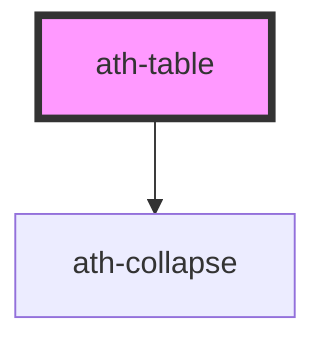

# ath-table

<!-- Auto Generated Below -->

## Properties

| Property      | Attribute       | Description                                           | Type                               | Default                |
| ------------- | --------------- | ----------------------------------------------------- | ---------------------------------- | ---------------------- |
| `clickable`   | `clickable`     | Enable clickable rows with action column              | `boolean`                          | `false`                |
| `color`       | `color`         | Table color                                           | `"primary" \| "secondary"`         | `TableColor.Primary`   |
| `frozen`      | `frozen`        | Fix the first or last column                          | `"first" \| "last" \| "none"`      | `undefined`            |
| `noSelectAll` | `no-select-all` | Hides select all checkbox when selectable is multiple | `boolean`                          | `false`                |
| `selectable`  | `selectable`    | Row selection mode                                    | `"multiple" \| "none" \| "single"` | `TableSelectable.None` |
| `size`        | `size`          | Row height                                            | `"lg" \| "md" \| "sm"`             | `TableSize.Small`      |
| `striped`     | `striped`       | Enable zebra striping                                 | `"columns" \| "none" \| "rows"`    | `TableStriping.None`   |

## Events

| Event                | Description                           | Type                                                                 |
| -------------------- | ------------------------------------- | -------------------------------------------------------------------- |
| `athSelectionChange` | Fired whenever row selection changes  | `CustomEvent<{ selectedIndexes: number[]; selectedValues: any[]; }>` |
| `athTableClick`      | Fired when a clickable row is clicked | `CustomEvent<{ rowIndex: number; rowValue: any; rowId?: string; }>`  |

## Methods

### `refresh() => Promise<void>`

Refresh the table. Useful when dynamically changing content

#### Returns

Type: `Promise<void>`

## Dependencies

### Depends on

- [ath-collapse](../collapse)

### Graph

----------------------------------------------

*Built with [StencilJS](https://stenciljs.com/)*
