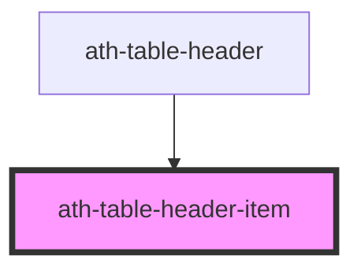

# ath-table-header-item

<!-- Auto Generated Below -->

## Properties

| Property           | Attribute           | Description                                                                                                                                        | Type                            | Default              |
| ------------------ | ------------------- | -------------------------------------------------------------------------------------------------------------------------------------------------- | ------------------------------- | -------------------- |
| `alignment`        | `alignment`         | Column alignment                                                                                                                                   | `"center" \| "left" \| "right"` | `undefined`          |
| `cellWidth`        | `cell-width`        | Column width (px, %, auto)                                                                                                                         | `string`                        | `'auto'`             |
| `color`            | `color`             | Item color                                                                                                                                         | `"primary" \| "secondary"`      | `TableColor.Primary` |
| `frozen`           | `frozen`            | If this column is fixed                                                                                                                            | `"first" \| "last" \| "none"`   | `undefined`          |
| `hasInteractivity` | `has-interactivity` | If this column contains interactive elements (menus, buttons, links, etc.). This property will be passed down to all row items in the same column. | `boolean`                       | `false`              |
| `size`             | `size`              | Item size                                                                                                                                          | `"lg" \| "md" \| "sm"`          | `undefined`          |

## Dependencies

### Used by

 - [ath-table-header](../table-header)

### Graph

----------------------------------------------

*Built with [StencilJS](https://stenciljs.com/)*
