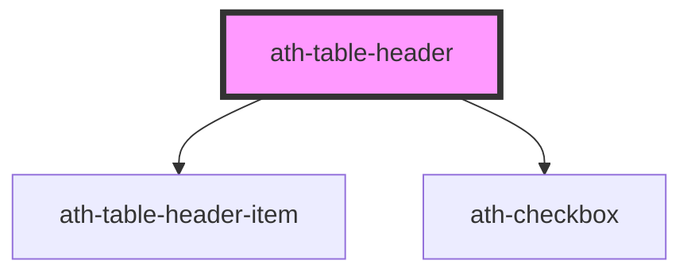

# ath-table-header

<!-- Auto Generated Below -->

## Properties

| Property         | Attribute          | Description                                                                  | Type                                   | Default                |
| ---------------- | ------------------ | ---------------------------------------------------------------------------- | -------------------------------------- | ---------------------- |
| `clickable`      | `clickable`        | Enable clickable rows with action column                                     | `boolean`                              | `false`                |
| `color`          | `color`            | Header color                                                                 | `"primary" \| "secondary"`             | `TableColor.Primary`   |
| `frozen`         | `frozen`           | If the row has a fixed column, specify if it's the first or last column      | `"first" \| "last" \| "none"`          | `TableFrozen.None`     |
| `noSelectAll`    | `no-select-all`    | Hides select all checkbox when selectable is multiple                        | `boolean`                              | `false`                |
| `selectAllState` | `select-all-state` | Current state of the select all checkbox (false \| true \| indeterminate)    | `"false" \| "indeterminate" \| "true"` | `CheckboxValue.False`  |
| `selectable`     | `selectable`       | Selection mode (none \| single \| multiple)                                  | `"multiple" \| "none" \| "single"`     | `TableSelectable.None` |
| `selectedRows`   | `selected-rows`    | Number of currently selected rows (used for determining indeterminate state) | `number`                               | `0`                    |
| `size`           | `size`             | Header size                                                                  | `"lg" \| "md" \| "sm"`                 | `undefined`            |
| `totalRows`      | `total-rows`       | Total number of selectable rows (used for determining indeterminate state)   | `number`                               | `0`                    |

## Events

| Event                | Description                                  | Type                                                          |
| -------------------- | -------------------------------------------- | ------------------------------------------------------------- |
| `athSelectAllChange` | Fired when select all checkbox state changes | `CustomEvent<{ selectAll: boolean; state: CheckboxValues; }>` |

## Dependencies

### Depends on

- [ath-table-header-item](../table-header-item)
- [ath-checkbox](../../checkbox)

### Graph

----------------------------------------------

*Built with [StencilJS](https://stenciljs.com/)*
