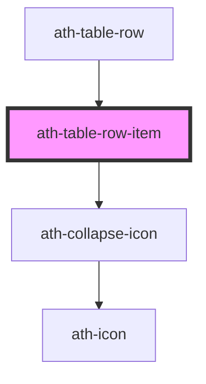

# ath-table-row-item

<!-- Auto Generated Below -->

## Properties

| Property               | Attribute                | Description                                                                                                                                                        | Type                            | Default              |
| ---------------------- | ------------------------ | ------------------------------------------------------------------------------------------------------------------------------------------------------------------ | ------------------------------- | -------------------- |
| `alignment`            | `alignment`              | Cell alignment                                                                                                                                                     | `"center" \| "left" \| "right"` | `undefined`          |
| `cellWidth`            | `cell-width`             | Column width (px, %, auto)                                                                                                                                         | `string`                        | `'auto'`             |
| `color`                | `color`                  | Background color                                                                                                                                                   | `"primary" \| "secondary"`      | `TableColor.Primary` |
| `expanded`             | `expanded`               | Current expanded state (used when expander = true)                                                                                                                 | `boolean`                       | `false`              |
| `expander`             | `expander`               | Marks this cell as an expander control (collapse/expand). Internal use by ath-table-row.                                                                           | `boolean`                       | `false`              |
| `expanderAriaControls` | `expander-aria-controls` | Aria-controls value for the expander button (ID of the collapsable content)                                                                                        | `string`                        | `undefined`          |
| `frozen`               | `frozen`                 | If this cell is fixed, created a first or last column fixed                                                                                                        | `"first" \| "last" \| "none"`   | `TableFrozen.None`   |
| `hasInteractivity`     | `has-interactivity`      | If this cell contains interactive elements (menus, buttons, links, etc.). When true, row click events will be prevented to avoid conflicts with cell interactions. | `boolean`                       | `false`              |
| `isChild`              | `is-child`               | Marks this cell as the first data cell of a child row (for indentation)                                                                                            | `boolean`                       | `false`              |
| `isHeader`             | `is-header`              | If this cell is header of the row                                                                                                                                  | `boolean`                       | `false`              |
| `noFrozenShadow`       | `no-frozen-shadow`       | If true, no shadow will be applied to the frozen cell                                                                                                              | `boolean`                       | `false`              |
| `size`                 | `size`                   | Table size                                                                                                                                                         | `"lg" \| "md" \| "sm"`          | `undefined`          |
| `striped`              | `striped`                | Striped background                                                                                                                                                 | `boolean`                       | `false`              |

## Dependencies

### Used by

 - [ath-table-row](../table-row)

### Depends on

- [ath-collapse-icon](../../collapse)

### Graph

----------------------------------------------

*Built with [StencilJS](https://stenciljs.com/)*
