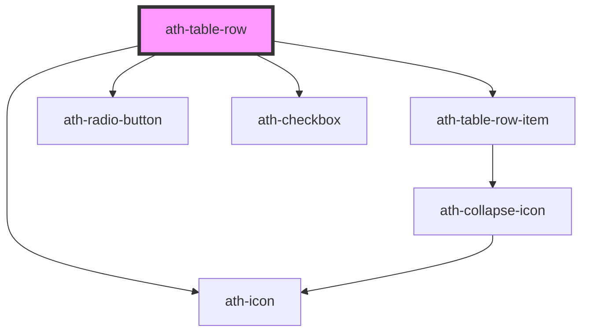

# ath-table-row

<!-- Auto Generated Below -->

## Properties

| Property             | Attribute              | Description                                                                                   | Type                               | Default                |
| -------------------- | ---------------------- | --------------------------------------------------------------------------------------------- | ---------------------------------- | ---------------------- |
| `clickable`          | `clickable`            | Enable clickable functionality                                                                | `boolean`                          | `false`                |
| `clickableAriaLabel` | `clickable-aria-label` | Aria label of row click button                                                                | `string`                           | `'Navegar'`            |
| `color`              | `color`                | Row color                                                                                     | `"primary" \| "secondary"`         | `TableColor.Primary`   |
| `expanded`           | `expanded`             | Controls the expanded state for rows that have children                                       | `boolean`                          | `false`                |
| `frozen`             | `frozen`               | If the row has a fixed column, specify if it's the first or last column                       | `"first" \| "last" \| "none"`      | `TableFrozen.None`     |
| `hasChildren`        | `has-children`         | Whether this row has children                                                                 | `boolean`                          | `false`                |
| `last`               | `last`                 | Indicates that this is the last visual row (no border). Internal use by ath-table             | `boolean`                          | `false`                |
| `parentId`           | `parent-id`            | Optional parent row id if this row is a child                                                 | `string`                           | `undefined`            |
| `reserveClickable`   | `reserve-clickable`    | Reserve space for clickable column. Internal use by ath-table                                 | `boolean`                          | `false`                |
| `reserveExpander`    | `reserve-expander`     | Reserve space for expander column even if this row has no children. Internal use by ath-table | `boolean`                          | `false`                |
| `rowId`              | `row-id`               | Unique id for this row                                                                        | `string`                           | `undefined`            |
| `selectable`         | `selectable`           | Selection mode (none \| single \| multiple)                                                   | `"multiple" \| "none" \| "single"` | `TableSelectable.None` |
| `selected`           | `selected`             | Current selection state                                                                       | `boolean`                          | `false`                |
| `selectionGroupName` | `selection-group-name` | Group name for radios in single mode                                                          | `string`                           | `undefined`            |
| `size`               | `size`                 | Row size                                                                                      | `"lg" \| "md" \| "sm"`             | `undefined`            |
| `striped`            | `striped`              | Apply zebra striping                                                                          | `"columns" \| "none" \| "rows"`    | `TableStriping.None`   |
| `value`              | `value`                | Optional row value to be included in selection events                                         | `any`                              | `undefined`            |

## Events

| Event                   | Description                              | Type                                              |
| ----------------------- | ---------------------------------------- | ------------------------------------------------- |
| `athRowClick`           | Emits when this clickable row is clicked | `CustomEvent<{ rowValue: any; rowId?: string; }>` |
| `athRowSelectionChange` | Emits when this row selection changes    | `CustomEvent<{ selected: boolean; }>`             |

## Dependencies

### Depends on

- [ath-table-row-item](../table-row-item)
- [ath-radio-button](../../radio-button)
- [ath-checkbox](../../checkbox)
- [ath-icon](../../icon)

### Graph

----------------------------------------------

*Built with [StencilJS](https://stenciljs.com/)*
