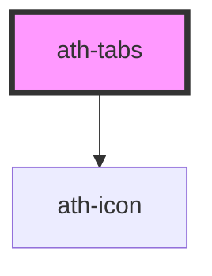

# ath-tabs

<!-- Auto Generated Below -->

## Properties

| Property        | Attribute         | Description                              | Type                   | Default               |
| --------------- | ----------------- | ---------------------------------------- | ---------------------- | --------------------- |
| `items`         | `items`           | Lista de tabs a generar                  | `TabItem[] \| string`  | `undefined`           |
| `listAriaLabel` | `list-aria-label` | Etiqueta accesible para la lista de tabs | `string`               | `undefined`           |
| `type`          | `type`            | Tipo de Tabs                             | `"box" \| "underline"` | `TabsTypes.Underline` |

## Dependencies

### Depends on

- [ath-icon](../icon)

### Graph

----------------------------------------------

*Built with [StencilJS](https://stenciljs.com/)*
