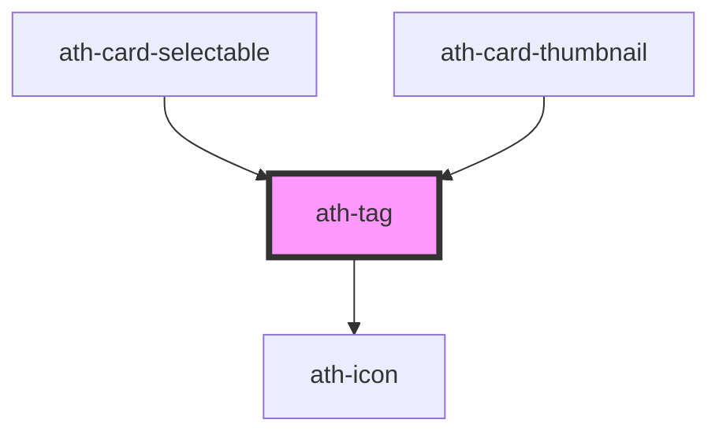

# ath-tag

<!-- Auto Generated Below -->

## Properties

| Property      | Attribute      | Description                                        | Type                                                                                       | Default             |
| ------------- | -------------- | -------------------------------------------------- | ------------------------------------------------------------------------------------------ | ------------------- |
| `color`       | `color`        | Color del tag acompañando al propósito del mensaje | `"accent" \| "danger" \| "disabled" \| "primary" \| "secondary" \| "success" \| "warning"` | `TAG_DEFAULT_COLOR` |
| `headingText` | `heading-text` | Texto que se visualiza dentro del tag              | `string`                                                                                   | `undefined`         |
| `icon`        | `icon`         | Icono                                              | `string`                                                                                   | `undefined`         |
| `size`        | `size`         | Tamaño del tag                                     | `"lg" \| "md" \| "sm"`                                                                     | `TAG_DEFAULT_SIZE`  |

## Dependencies

### Used by

 - [ath-card-selectable](../card-selectable)
 - [ath-card-thumbnail](../card/card-thumbnail)

### Depends on

- [ath-icon](../icon)

### Graph

----------------------------------------------

*Built with [StencilJS](https://stenciljs.com/)*
