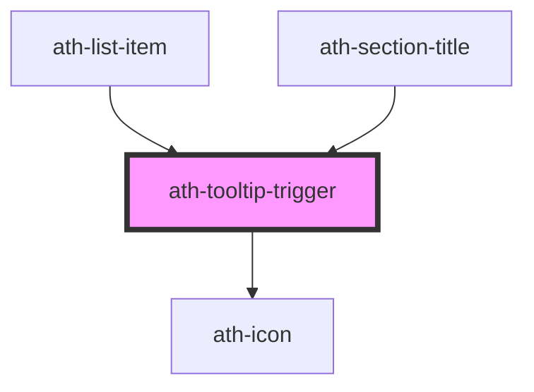

# ath-tooltip-trigger

<!-- Auto Generated Below -->

## Properties

| Property    | Attribute    | Description                          | Type                           | Default             |
| ----------- | ------------ | ------------------------------------ | ------------------------------ | ------------------- |
| `ariaLabel` | `aria-label` | The aria-label attribute of the icon | `string`                       | `'Más información'` |
| `icon`      | `icon`       | The icon name                        | `string`                       | `Icons.Info`        |
| `size`      | `size`       | The size of the icon                 | `"lg" \| "md" \| "sm" \| "xs"` | `'md'`              |

## Events

| Event      | Description                         | Type                |
| ---------- | ----------------------------------- | ------------------- |
| `athBlur`  | Emitted when the button loses focus | `CustomEvent<void>` |
| `athClick` | Emitted when the button is clicked  | `CustomEvent<void>` |
| `athFocus` | Emitted when the button gains focus | `CustomEvent<void>` |

## Dependencies

### Used by

 - [ath-list-item](../list/list-item)
 - [ath-section-title](../section-title)

### Depends on

- [ath-icon](../icon)

### Graph

----------------------------------------------

*Built with [StencilJS](https://stenciljs.com/)*
