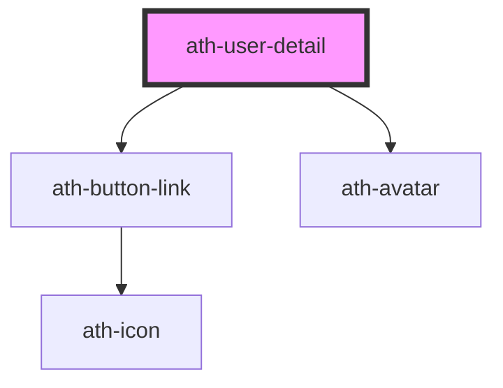

# ath-user-detail

<!-- Auto Generated Below -->

## Properties

| Property          | Attribute           | Description                                  | Type                                                  | Default     |
| ----------------- | ------------------- | -------------------------------------------- | ----------------------------------------------------- | ----------- |
| `buttonAriaLabel` | `button-aria-label` | The aria-label attribute of the button-link. | `string`                                              | `undefined` |
| `clickable`       | `clickable`         | If true, the user can click the button-link. | `boolean`                                             | `false`     |
| `description`     | `description`       | User Description.                            | `string`                                              | `undefined` |
| `initials`        | `initials`          | User initials.                               | `string`                                              | `undefined` |
| `srcImage`        | `src-image`         | Avatar SRC image.                            | `string`                                              | `undefined` |
| `type`            | `type`              | Type of avatar.                              | `"default" \| "hide-avatar" \| "image" \| "initials"` | `undefined` |
| `userName`        | `user-name`         | User Name.                                   | `string`                                              | `undefined` |

## Events

| Event       | Description                           | Type                |
| ----------- | ------------------------------------- | ------------------- |
| `athAction` | Emmitted when button-link is clicked. | `CustomEvent<void>` |

## Dependencies

### Depends on

- [ath-button-link](../../button-link)
- [ath-avatar](../../avatar)

### Graph

----------------------------------------------

*Built with [StencilJS](https://stenciljs.com/)*
