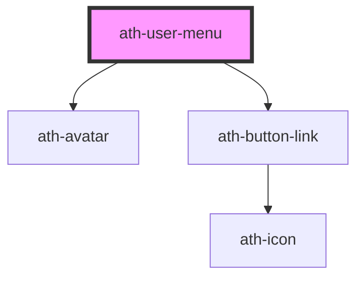

# ath-user-menu

<!-- Auto Generated Below -->

## Properties

| Property   | Attribute   | Description                        | Type                                                  | Default     |
| ---------- | ----------- | ---------------------------------- | ----------------------------------------------------- | ----------- |
| `initials` | `initials`  | Initials to display in the avatar. | `string`                                              | `undefined` |
| `open`     | `open`      | Indica si user-menu esta abierto   | `boolean`                                             | `false`     |
| `srcImage` | `src-image` | Define la src para imagen avatar   | `string`                                              | `undefined` |
| `type`     | `type`      | Define el tipo de avatar           | `"default" \| "hide-avatar" \| "image" \| "initials"` | `undefined` |
| `userName` | `user-name` | Define el nombre del usuario       | `string`                                              | `undefined` |

## Events

| Event       | Description                     | Type                                                   |
| ----------- | ------------------------------- | ------------------------------------------------------ |
| `athAction` | Emitted when an item is clicked | `CustomEvent<{ item: HTMLAthMenuButtonItemElement; }>` |

## Dependencies

### Depends on

- [ath-avatar](../../avatar)
- [ath-button-link](../../button-link)

### Graph

----------------------------------------------

*Built with [StencilJS](https://stenciljs.com/)*
